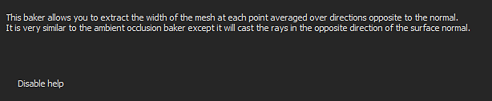

# Substance 3D Painter

È possibile accedere alla finestra di esegue i baking tramite [Impostazioni set di texture](https://experienceleague.adobe.com/en/docs/substance-3d-painter/using/interface/texture-set/texture-set-settings). Fai clic sul pulsante &quot;**Esegue i baking mappe trama**&quot; per aprire la finestra di esegue i baking del progetto corrente.

## Panoramica

{width="400px"}

La finestra di esegue i baking è divisa in tre componenti principali.

### Elenco baker

Nella parte superiore sinistra della finestra sono disponibili diversi pulsanti.

Accanto a tali pulsanti è presente una casella di controllo che, se selezionata, consente di attivare la esegue i baking per la esegue i baking. I pulsanti con un’icona accanto ai rispettivi nomi indicano quelli che richiedono una trama ad alto poli. Questa icona visualizza un messaggio di avvertenza se sono ora disponibili caratteri high-poly.

| *Pulsante* | *Descrizione* |
| --- | --- |
| **Comune** | Modificare la visualizzazione dei parametri in [Parametri comuni](../../../bakers-settings/common-parameters/common-parameters.md). |
| **Normale** | Modificare la visualizzazione dei parametri in [Parametri normali](../../../bakers-settings/normal-map-from-mesh/normal-map-from-mesh.md). |
| **Spazio globale normale** | Modificare la visualizzazione dei parametri in [Parametri di World Space Normal](../../../bakers-settings/world-space-normals/world-space-normals.md). |
| **ID** | Modificare la visualizzazione dei parametri in [Parametri colore](../../../bakers-settings/color-map-from-mesh/color-map-from-mesh.md). |
| **Occlusione ambientale** | Modificare la visualizzazione dei parametri in [parametri di Occlusione ambientale](../../../bakers-settings/ambient-occlusion-from/ambient-occlusion-from-mesh.md). |
| **Curvatura** | Modificate la visualizzazione dei parametri in [Parametri di curvatura](../../../bakers-settings/curvature/curvature.md). |
| **Posizione** | Modificare la visualizzazione dei parametri in [Parametri di posizione](../../../bakers-settings/position/position.md). |
| **Thickness** | Modificare la visualizzazione dei parametri in [parametri di Thickness](../../../bakers-settings/thickness-map-from-mesh/thickness-map-from-mesh.md). |
| **Height** | Modificare la visualizzazione dei parametri in [parametri di Height](../../../bakers-settings/height-map-from-mesh/height-map-from-mesh.md). |
| **Normali incurvate** | Modificare la visualizzazione dei parametri in [parametri di Normali incurvate](../../../bakers-settings/bent-normals-from-mesh/bent-normals-from-mesh.md). |
| **Opacità** | Modificate la visualizzazione dei parametri in [Parametri di opacità](../../../bakers-settings/opacity-mask-from-mesh/opacity-mask-from-mesh.md). |

### Parametri

In questa parte della finestra vengono visualizzate le varie impostazioni di esegue i baking. Il contenuto può variare a seconda del baker attualmente selezionato o dei parametri comuni.

Per ulteriori informazioni sulle impostazioni di baker, consulta [Impostazioni di Baker](../../../bakers-settings/bakers-settings.md).

### Messaggio della Guida

{width="500px"}

In questa parte della finestra vengono visualizzate le descrizioni comandi e i messaggi della Guida relativi alle impostazioni. Posizionare il mouse su un&#39;impostazione per leggere la descrizione comandi.
