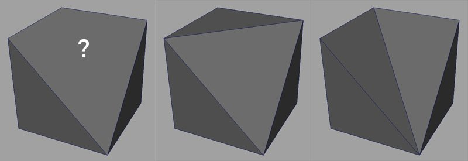

# Triangolazione prima della cottura

Le trame 3D possono essere definite con poligoni con più bordi per faccia. Di solito tramite quad (4 spigoli), a volte di più (n-goni).\
Il software tuttavia trasforma questi poligoni in triangoli in un secondo momento, perché è più facile gestire ed eseguire il calcolo con (in particolare sulla GPU).

## In che modo la triangolazione può influire su una trama?

**nessuna soluzione standard** per convertire Quad/N-Gons in triangoli. Come illustrato nell&#39;immagine precedente, sono valide più scelte.\
È improbabile che i panettieri triangolino trame come farebbe un motore di gioco perché scegliamo un algoritmo specifico su un altro.

## Perché triangolare prima di cuocere?

Il processo di cottura legge la geometria e quindi codifica le informazioni in texture.\
Poiché tali informazioni sono basate sugli UV e talvolta sulla topologia della trama, altri software potrebbero decodificare le informazioni in modo errato se non leggono la geometria allo stesso modo di quando applicano la texture.

Nell’immagine seguente, potete vedere la trama low-poly in alto a sinistra e quella high-poly in alto a destra.\
In basso c&#39;è il polo basso con la mappa normale ricavata dal polo alto. La trama a sinistra usa una triangolazione identica a quella usata dalla Substance Painter durante la cottura. La trama a destra non visualizza e mostra artefatti neri. Questo perché non c&#39;è corrispondenza tra il modo in cui la mappa normale è stata cotta e il modo in cui la trama è attualmente triangolata. Questo problema può essere risolto **aggiornando la trama e/o riattivando**.

