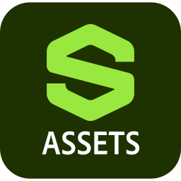

# Icone di Substance 3D per gli artisti

<table>
  <tr style="border: 0;">
    <td style="border: 0;" valign="top"></td>
    <td style="border: 0;" valign="top"></td>
    <td style="border: 0;" valign="top"></td>
    <td style="border: 0;" valign="top"></td>
    <td style="border: 0;" valign="top"></td>
    <td style="border: 0;" valign="top"></td>
    <td style="border: 0;" valign="top"></td>
  </tr>
</table>

Gli artisti che desiderano includere le icone delle applicazioni Substance 3D nella grafica pubblicata possono scaricarle di seguito. Le immagini usano il formato SVG, quindi possono essere utilizzate in qualsiasi scala.

[Scarica una cartella zip contenente le versioni a colori, in bianco e nero delle icone dell’applicazione Substance 3D.](../../assets/substance3d-icons.zip)

## Creative Cloud libreria

Gli utenti Creative Cloud possono accedere a queste icone nelle applicazioni Creative Cloud tramite questa libreria condivisa:

[Icone di Substance 3D](https://www.adobe.com/files/libraries/urn:aaid:sc:EU:0e944904-0efe-427f-8547-92744a19eeaf)

## Esempi

