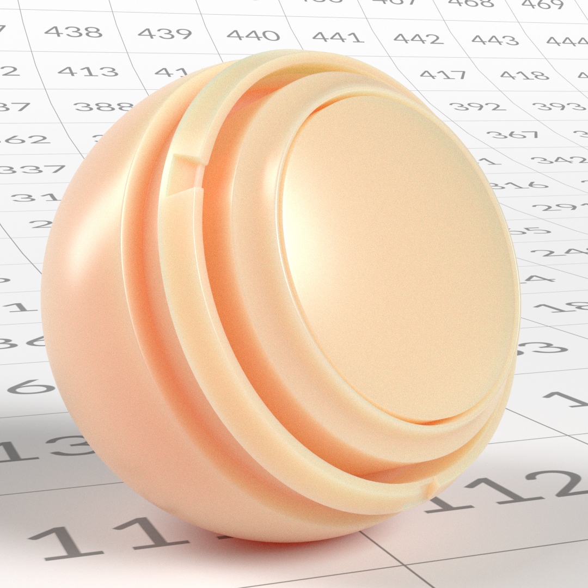

# OpenPBR

[**Scarica una versione offline della pagina.**](../assets/openpbrf/openpbr.pdf)

**OpenPBR** è un modello di ombreggiatura della superficie aperto e su base fisica progettato per fornire un modo coerente e prevedibile di descrivere i materiali su diversi strumenti 3D, moduli di rendering e pipeline. Definisce un singolo modello di materiale completo in grado di rappresentare un&#39;ampia gamma di superfici reali, pur rimanendo abbastanza flessibile da supportare un aspetto più stilizzato o guidato dagli artisti utilizzando parametri fisicamente significativi.

Il modello risolve le incongruenze di lunga data tra shader &quot;standard&quot; che si comportano in modo simile nel nome ma differiscono nelle definizioni dei parametri e nelle ipotesi fisiche tra le applicazioni. Basato sui principi del rendering basato sulla fisica, OpenPBR descrive i materiali in termini di comportamento della luce reale, sottolineando la conservazione dell&#39;energia, intervalli di parametri intuitivi e risposte di illuminazione stabili. Anziché prescrivere un’interfaccia utente specifica, OpenPBR definisce il comportamento dei materiali a un livello fondamentale, consentendo agli strumenti di implementare il modello a modo loro, preservando al contempo risultati visivi coerenti man mano che le risorse si spostano tra le applicazioni e le pipeline.

Questo documento è una guida incentrata sugli artisti per comprendere e lavorare con OpenPBR. Spiega i principi di base del modello, come i suoi componenti descrivono il comportamento della luce del mondo reale, e come queste idee si traducono in pratica nella creazione di materiali. Invece di concentrarsi su un’applicazione specifica, la guida è destinata agli artisti 3D che lavorano in aree come lo sviluppo di look, la creazione di texture e il rendering e desiderano creare materiali solidi e fisicamente plausibili che rimangano coerenti e trasferibili in diversi ambienti software.

>[!NOTE]
>
> Se stai già lavorando con OpenPBR e stai cercando assistenza tecnica, [le domande frequenti su OpenPBR](openpbr-faq.md) potrebbero già contenere le risposte alle tue domande.

*La scena dimostrativa di OpenPBR sopra riportata è stata creata da Nikie Monteleone. Celine Dameron ha creato materiali di esempio e rendering dei canali in questo documento.*

## Interoperabilità e standard dei file

### Un linguaggio del materiale condiviso con OpenPBR

Uno degli obiettivi principali di OpenPBR è migliorare il modo in cui i materiali si spostano tra gli strumenti. Anziché essere uno shader associato a un singolo modulo di rendering o applicazione, OpenPBR definisce un **modello di ombreggiatura condivisa**, un metodo comune per descrivere la risposta di un materiale alla luce.

Per gli artisti, questo significa che un materiale OpenPBR non è solo, ad esempio, &quot;un materiale Adobe&quot; o &quot;un materiale Autodesk&quot;, ma piuttosto una descrizione del comportamento superficie e volume che può, in linea di principio, essere compreso da più strumenti. L&#39;intento è che un materiale creato in un&#39;applicazione possa essere interpretato in modo coerente altrove, purché tali strumenti supportino il modello di OpenPBR.

### Il problema di interscambio delle risorse

La specifica di OpenPBR riconosce esplicitamente una sfida di lunga data nella produzione: **i materiali non viaggiano bene tra le applicazioni**. I diversi moduli di rendering utilizzano spesso nomi di parametro, presupposti di ombreggiatura e modelli sottostanti diversi, il che rende difficile e dispendiosa in termini di tempo la corrispondenza dell’aspetto.

OpenPBR è stato progettato come risposta a questo problema. Definendo un modello di materiale unico, fisicamente fondato, che soddisfi le esigenze di produzione comuni - metalli, dielettrici, materiali stratificati, trasmissione, dispersione - fornisce un target stabile per l&#39;interscambio. Anche se questo non garantisce una perfetta corrispondenza visiva in ogni situazione, riduce significativamente l&#39;ambiguità rispetto ai modelli di shader proprietari.

Per gli artisti, il vantaggio pratico è che OpenPBR mira a preservare *l&#39;intento*. Anche quando non è possibile una perfetta parità visiva, la struttura del materiale - che cos&#39;è il metallo, che cosa è trasmissivo, quanto è ruvida o anisotropa una superficie - rimane chiara e trasferibile.

### Relazione con MaterialX

OpenPBR è strettamente collegato a **MaterialX**, un framework standard del settore per descrivere i materiali e gli aspetti in modo indipendente dal renderer. L&#39;implementazione di riferimento di OpenPBR risiede all&#39;interno di MaterialX, il che significa che i materiali OpenPBR possono essere rappresentati utilizzando un formato di interscambio già supportato in molte pipeline.

Questa relazione è importante perché OpenPBR stesso **non è un formato di file**. Definisce invece *cosa* è un materiale, mentre MaterialX fornisce un modo standardizzato per *archiviare e scambiare* tale materiale tra gli strumenti. In pratica, questo consente di incorporare i materiali di OpenPBR in descrizioni di scene più ampie e di condividerli tra DCC e moduli di rendering che supportano MaterialX.

Per gli artisti, questo di solito accade sotto il cofano - ma spiega perché i materiali OpenPBR sono sempre più descritti come &#39;portatili&#39; o &#39;interoperabili&#39; nelle moderne condutture.

### Cosa significa e cosa significa interoperabilità

È importante stabilire aspettative realistiche riguardo all&#39;interoperabilità. OpenPBR non garantisce che un materiale sarà identico in ogni applicazione. Differenze nell’illuminazione, negli algoritmi di rendering, nella gestione del colore e nel supporto delle funzioni possono ancora influire sull’immagine finale.

Ciò che l&#39;OpenPBR fornisce è una linea di base comune: un insieme coerente di parametri e comportamenti, una comprensione condivisa di come i materiali sono costruiti e un percorso più chiaro per trasferire i materiali tra gli strumenti senza ricostruirli da zero.

Per gli artisti, questo significa meno sorprese quando le risorse si spostano tra reparti o applicazioni e un flusso di lavoro che enfatizza la logica dei materiali durevoli piuttosto che trucchi specifici per gli strumenti.

### Implicazioni pratiche per gli artisti

Dal punto di vista quotidiano, lavorare con OpenPBR incoraggia abitudini che supportano naturalmente l&#39;interoperabilità:

* Pensare in termini di comportamento alla luce piuttosto che di tipi di materiale specifici per l&#39;applicazione
* Utilizzo di parametri fisicamente significativi (metallizzazione, rugosità, trasmissione, dispersione)
* Evitando la dipendenza da soluzioni non documentate o specifiche per il rendering

Anche quando i materiali non lasciano mai una singola applicazione, queste pratiche sono in linea con i moderni standard di pipeline, rendendo le risorse più scalabili con l&#39;evolversi degli strumenti e dei moduli di rendering.

## Tipi di materiale

### Materiali definiti dall&#39;interazione con la luce

L&#39;OpenPBR è un modello monolitico (un &#39;uber-shader&#39;) destinato a rappresentare un&#39;ampia gamma di tipi di materiale; tali tipi sono descritti in termini di come la luce interagisce con essi. Invece di definire i materiali in termini di predefiniti fissi come, ad esempio, &quot;vetro&quot; o &quot;pelle&quot;, ogni materiale OpenPBR è costruito da un modello di stratificazione orizzontale e verticale, che consente agli artisti di fondere insieme caratteristiche completamente definite e fisicamente significative, come la riflessione diffusa, la riflessione degli specular, la trasmissione, la dispersione del sottosuolo e la stratificazione. Combinazioni diverse di questi comportamenti producono naturalmente materiali familiari del mondo reale.

<table>
  <tr style="border: 0;">
    <td style="border: 0;" valign="top"></td>
    <td style="border: 0;" valign="top"></td>
    <td style="border: 0;" valign="top"></td>
  </tr>
</table>

Questo approccio utilizza un modello fisso che definisce in anticipo il quadro di stratificazione e miscelazione, eludendo in tal modo qualsiasi requisito per l&#39;artista di creare una rete di ombreggiatura caso per caso, e consente all&#39;OpenPBR di rappresentare sia materiali semplici che complessi in modo coerente e fisicamente fondato.

 Fare clic per eseguire lo zoom. *Figura adattata dalle specifiche OpenPBR Surface, © Academy Software Foundation, utilizzata con la licenza Apache 2.0*

### Comportamenti dei materiali di base

Sebbene l&#39;OpenPBR non imponga tipi di materiale rigorosi, la maggior parte dei materiali del mondo reale rientra in poche categorie comportamentali ampie. Comprendere queste categorie può aiutare a stabilire un solido modello mentale per i materiali da costruzione.

### Materiali Dielettrici (Non Metallici)

<table>
  <tr style="border: 0;">
    <td style="border: 0;" valign="top"> <em>Un esempio di materiale dieletrico.</em></td>
    <td style="border: 0;" valign="top">I dielettrici sono materiali non metallici come plastica, legno, pietra, tessuto, gomma e pelle. Le caratteristiche che li contraddistinguono sono:  <ul><li>Componente di diffusione visibile</li><li>Riflessi di specular per lo più incolori (bianchi)</li><li>Riflettività controllata principalmente dall'indice di rifrazione (IOR)</li><li>Comportamento Nessun riflesso metallico</li></ul>  <strong>Parametri chiave per i materiali dielettrici:</strong>  <ul><li>Colore di base definisce il colore complessivo del materiale</li><li>Il colore Specular influenza la tinta delle aree di luce degli specular (in primo piano negli angoli di pascolo)</li><li>La rugosità dello Specular controlla la nitidezza o la sfocatura delle luci degli specular</li><li>Spessore Specular ridimensiona l’intensità complessiva delle luci dello specular </li><li>Per i materiali dielettrici, la riflessione diffusa domina l'aspetto della superficie ed è controllata dal Colore di base. I riflessi degli Specular sono limitati con una normale incidenza e aumentano verso gli angoli di pascolo, ma rimangono non colorati.</li></ul></td>
  </tr>
</table>

### Materiali metallici

<table>
  <tr style="border: 0;">
    <td style="border: 0;" valign="top"> <em>Esempio di materiale metallico.</em></td>
    <td style="border: 0;" valign="top">I materiali metallici come l'acciaio, l'alluminio, il rame o l'oro si comportano in modo fondamentalmente diverso dai materiali non metallici (dielettrici). Per i metalli, l'aspetto è guidato quasi interamente dal riflesso degli specular: a differenza dei dielettrici, i metalli non hanno una componente diffusa e la luce non dispersione sotto la superficie, ma viene riflessa direttamente. Le caratteristiche che li contraddistinguono sono:  <ul><li>Nessuna componente diffusa: il colore deriva interamente dal riflesso</li><li>Riflessi di specular colorati</li><li>I dettagli della superficie, in particolare la rugosità, svolgono un ruolo importante nell'aspetto</li></ul>  <strong>Parametri chiave per i materiali metallici:</strong>  <ul><li>Colore di base controlla il colore dei riflessi</li><li>La rugosità dello Specular controlla la nitidezza o la sfocatura di tali riflessi</li><li>Specular: lo spessore ridimensiona l’intensità della riflessione</li></ul></td>
  </tr>
</table>

### Metallicità base

Metallicità di base definisce se un materiale si comporta come un dielettrico o un metallo. Non si tratta solo di una regolazione visiva, ma di un cambiamento nella risposta di luce sottostante del materiale.

* **0** → completamente non metallico (diffusione + specular)
* **1** → completamente metallico (solo specular)
* **0-1** → una combinazione di entrambi i comportamenti. I valori intermedi sono i migliori per miscele di materiali come dirt, corrosione o superfici usurate, piuttosto che materiali &quot;parzialmente metallici&quot;.

#### Linee guida pratiche per il metalness

* Utilizza **0** o **1** per la maggior parte dei materiali
* Usare i valori medi solo per superfici miste
* Affidatevi alla ruvidità e ai dettagli della superficie per modellare l&#39;aspetto metallico.

Usate stratificazioni (ad esempio, Rivestimento) invece di abbassare il valore dei metalli dipinti o rivestiti, dei Materiali trasparenti e trasmissivi.

### Materiali trasparenti e trasmissivi

Materiali trasparenti e trasmissivi permettono alla luce di passare attraverso di essi. Esempi comuni sono il vetro, molti liquidi e le plastiche chiare o colorate. Le caratteristiche che li contraddistinguono sono:

* La luce entra in superficie ed esce dal lato opposto
* Il thickness influisce fortemente sull’aspetto
* Rifrazione controllata dall’indice di rifrazione (IOR) e influenzata dalla rugosità della superficie
* Rifrazione, assorbimento, dispersione e dispersione modellano l’aspetto finale

La trasmissione descrive come la luce attraversa un oggetto. Le aree più spesse appaiono più scure o più saturate, mentre quelle più sottili appaiono più chiare. Parametri quali Colore di trasmissione, Profondità di trasmissione, Colore Dispersione e Dispersione interagiscono tra loro per controllare questo comportamento.

Un punto di distinzione tra i termini &quot;trasparente&quot; e &quot;trasmissivo&quot;: &quot;trasparente&quot; è un termine reale, quotidiano; qualcosa è trasparente se possiamo vedere attraverso di esso. &quot;Trasmissivo&quot; è un sinonimo di &quot;Traslucido&quot;. Il vetro ghiacciato, ad esempio, consente alla luce di passare attraverso di esso (e quindi è trasmissivo), ma non è trasparente - non possiamo vedere attraverso di esso.

### Materiali sottosuperficiali

<table>
  <tr style="border: 0;">
    <td style="border: 0;" valign="top"> <em>Esempio di un materiale che utilizza la dispersione sotto la superficie.</em></td>
    <td style="border: 0;" valign="top">I materiali subsuperficiali consentono alla luce di entrare nella superficie, dispersione sotto di essa e uscire di nuovo vicino al punto di ingresso. Esempi comuni includono pelle, cera, marmo e molti materiali organici, come molti tipi di cibo. - frutta, verdura o formaggio Saint-Nectaire, ad esempio. Le caratteristiche che definiscono i materiali sottosuperficiali sono:   <ul><li>Ombreggiatura morbida e diffusa</li><li>Sanguinamento del colore nelle aree sottili</li><li>L’aspetto dipende dal thickness</li><li>La luce non attraversa l’oggetto</li></ul>   La dispersione sottosuperficiale è distinta dalla trasmissione. Mentre la trasmissione descrive la luce che passa attraverso un materiale e esce dal lato opposto, la dispersione sottosuperficiale descrive la luce che entra in una superficie, che si diffonde all'interno di quella superficie, e poi esce nelle vicinanze del punto in cui è entrata, per lo più sullo stesso lato. In particolare, i materiali metallici non supportano la trasmissione o la dispersione sottosuperficiale. La modifica del valore di trasmissione o sottosuperficie di un materiale completamente metallico (ovvero un materiale il cui valore di Metallità di base è 1) non influisce sul suo aspetto.</td>
  </tr>
</table>

## Fusione Tra Comportamenti Di Materiale

I materiali del mondo reale sono raramente perfettamente puri. Molte superfici vengono descritte come combinazioni di comportamenti, anziché appartenere a una singola categoria. Se ad esempio una superficie mostra segni di dirt, usura o ruggine, le diverse parti della superficie reagiranno alla luce in modi diversi. Questa operazione è supportata da OpenPBR, che consente di eseguire la fusione in modo uniforme da una parte all&#39;altra di una superficie.

### Metalness come fusione

<table>
  <tr style="border: 0;">
    <td style="border: 0;" valign="top"> <em>In questo materiale il ferro ha una metallizzazione di 1, mentre la ruggine ha una metallizzazione di 0. Possono esserci valori di metallizzazione intermedi in cui la ruggine passa al ferro.</em></td>
    <td style="border: 0;" valign="top">Mentre il metalness è in genere impostato su 0 o 1 (cioè, interamente non metallico o interamente metallico), i valori intermedi sono significativi. Questi valori rappresentano le superfici in cui materiali metallici e non metallici sono mescolati insieme su piccola scala, in casi quali vernici contenenti particelle metalliche o fiocchi. Inoltre, come accennato in precedenza, i materiali OpenPBR sono costruiti a partire da strati che rappresentano interfacce fisiche distinte. È del tutto possibile che lo strato Base di un materiale (lo strato 'core') sia metallico, ma che abbia uno strato Coat non metallico sopra - lo strato Coat non è semplicemente un controllo aggiuntivo dello specular - rappresenta una superficie fisica separata attraverso la quale deve passare la luce. Questo sarebbe il caso di alcuni tipi di pittura per auto, per esempio: i fiocchi metallici sarebbero rappresentati nello strato Base del materiale, mentre lo strato Cappotto rappresenterebbe una lacca trasparente.</td>
  </tr>
</table>

### Combinare più livelli per creare un comportamento complesso

I materiali complessi, come il vetro smerigliato o la pittura per auto menzionati in precedenza in questa sezione, vengono creati combinando più comportamenti in modo controllato. Ad esempio:

* **Vetro smerigliato**: trasmissione combinata con elevata rugosità e dispersione
* **Metallo verniciato**: una superficie dielettrica su una base metallica, spesso con un pelo trasparente Anziché pensare in termini di predefiniti, è più efficace considerare quali comportamenti fisici sono presenti e come interagiscono. I materiali OpenPBR sono definiti da componenti fisicamente significativi che descrivono il modo in cui la luce interagisce con le superfici. I &#39;tipi&#39; di materiale emergono naturalmente dalle combinazioni di comportamenti, piuttosto che essere selezionati esplicitamente. Concentrandosi sull&#39;interazione della luce, sulla fusione e sulla stratificazione, gli artisti possono creare un&#39;ampia gamma di materiali realistici mantenendo la plausibilità fisica.

## Utilizzo di OpenPBR

### Architettura concettuale di un materiale OpenPBR

OpenPBR è progettato come un unico modello di ombreggiatura di superficie unificato in grado di rappresentare un&#39;ampia gamma di materiali reali. Anziché passare da un tipo di ombreggiatura all’altro per diversi tipi di materiale, OpenPBR combina più caratteristiche della superficie in un’unica architettura a più livelli.

Concettualmente, si può pensare che un materiale OpenPBR possieda tre elementi chiave:

* **Un framework di base**: OpenPBR ritiene che un materiale sia costituito da blocchi di base fisici che possono essere fusi (miscelazione orizzontale) o impilati uno sull&#39;altro (stratificazione verticale). Questi blocchi possono reagire alla luce in modo diverso. Quando due di questi blocchi vengono fusi, il risultato sarà una fusione del riflesso dei due. Quando sono disposti a strati, tuttavia, il blocco più basso riceverà e rifletterà solo la luce che passa il blocco più in alto. Questa configurazione consente agli artisti di considerare il materiale come una combinazione di componenti più semplici. La definizione di tali componenti e della loro ubicazione costituisce il secondo elemento chiave:
* **Una serie di livelli che contribuiscono alla struttura condivisa**: ogni materiale avrà un livello Base, che determina caratteristiche quali il colore principale del materiale o se il materiale è grezzo o liscio. I materiali possono anche avere livelli aggiuntivi (Thin-film, Coat e Fuzz) che possono riprodurre effetti come vernice o dust.
* **Un insieme di controlli per gli artisti**: un&#39;interfaccia che consente a un artista di controllare le regole del framework di riflessione, e quindi l&#39;aspetto complessivo del materiale OpenPBR. A seconda di come un software specifico possa rappresentare questi controlli nell’interfaccia utente, si tratta essenzialmente di un insieme di manopole o cursori che consentono all’artista di controllare, ad esempio, l’intensità dei riflessi o la tinta di colore che dovrebbe apparire a determinati angoli di visualizzazione. Alcuni controlli verranno applicati alla struttura generale (e quindi a tutti i livelli del materiale), mentre altri verranno applicati solo a livelli specifici.

### Livelli di materiale nel framework

 Fare clic per eseguire lo zoom. *Figura adattata dalle specifiche OpenPBR Surface, © Academy Software Foundation, utilizzata con la licenza Apache 2.0*

Ogni livello contribuisce a uno specifico effetto fisico e il modello di materiale gestisce il modo in cui questi livelli interagiscono in modo fisicamente plausibile. Questa struttura a più livelli è coerente in tutte le implementazioni di OpenPBR. Le singole applicazioni sono libere di presentare un’interfaccia utente che controlli questi livelli nel modo che preferiscono.

>[!NOTE]
>
> Ci sono due &quot;livelli&quot; che non appaiono nel diagramma qui sopra:
>
> * **Specular**: controlla la luminosità o la riflessione di una superficie, indipendentemente dal fatto che sia metallica o meno. Lo Specular è contenuto nella pila di livelli, ma non è di per sé un livello reale; è una proprietà dei livelli base e rivestimento che compaiono nella pila di livelli.
> * **Geometria**: mentre altri livelli di OpenPBR determinano la composizione del materiale, il livello Geometria definisce la forma e la presenza a cui viene applicato il materiale, inclusi l&#39;opacità, le normali, le tangenti e il comportamento a parete sottile.
>
> Continueremo a fare riferimento a Geometria e Specular come a &quot;livelli&quot; per semplicità.

I livelli che costituiscono una superficie OpenPBR, dal più profondo al più esterno, sono:

* **Livello base**: nella parte inferiore di un materiale OpenPBR, il livello base definisce l’interazione fondamentale tra la luce e il materiale. I parametri di questo livello Base determinano il colore principale del materiale, se è ruvido o liscio, e se (in termini di come interagisce con la luce) è metallico o non metallico (noto anche come dielettrico).

>[!NOTE]
>
> Per la maggior parte dei materiali lo strato Base è assolutamente necessario. Gli strati sovrastanti (Thin-film, Coat e Fuzz) possono essere presenti o meno, a seconda del tipo di materiale riprodotto in 3D.

* **Pellicola sottile**: se presente, un livello Pellicola sottile viene posizionato sopra il livello Base. Riproduce l’aspetto visivo di strati superficiali molto sottili, producendo colori iridescenti, come quelli visti nelle bolle di sapone, metallo bruciato o pellicole di olio.

* **Rivestimento**: un livello Rivestimento, se presente, riproduce un livello trasparente e riflettente posizionato sopra ogni altro livello tranne Fuzz. Questo può simulare effetti reali come vernici, superfici bagnate o alcuni tipi di pitture per auto.

* **Fuzz**: se presente, un livello Fuzz riproduce il riflesso da microfibre. Può essere utilizzato per riprodurre l&#39;aspetto di un tessuto sfocato, ad esempio, o uno strato di dust.

Il modo in cui ciascuno di questi livelli interagisce con la luce è determinato da un insieme di parametri.

### Tipi di materiale

Il Metallismo di base, a sua volta, determina le caratteristiche che si applicano allo strato successivo del materiale - un materiale interamente non metallico possiede caratteristiche diverse rispetto a un materiale metallico.

#### Materiali non metallici (Metallicità di base = 0)

Un materiale interamente non metallico (ovvero un materiale con un valore di Metallicità di base pari a 0) può essere suddiviso in tre tipi di base: **diffuso**, **sottosuperficie** o **traslucido**. Si noti che i materiali non rientrano necessariamente in uno solo dei tipi di base sopra riportati. Sono possibili materiali più complessi che sono una combinazione di questi tipi di materiali di base.

I **materiali per Diffuse** sono in genere materiali opachi come il legno o la pietra.

**I materiali sottosuperficiali** dispersione la luce internamente; la pelle o la cera rientrerebbero in questo tipo di materiale, ad esempio.

**I materiali di base traslucidi** consentono alla luce di passare attraverso di essi; questi includono materiali come il vetro, il cristallo o alcuni liquidi. I parametri chiave da tenere presenti sono i parametri globali di specular, i parametri del livello Base e i parametri di trasmissione specifici riportati di seguito. La differenza tra la diffusione subsuperficiale (SSS) e la trasmissione è essenzialmente che SSS non permette di vedere attraverso il materiale - un fascio di luce è sparso all&#39;interno di un materiale, e poi torna fuori dallo stesso lato. La trasmissione, al contrario, governa i materiali che sono almeno parzialmente trasparenti - un fascio di luce passa attraverso il materiale.

#### Materiali metallici (Metallicità > 0)

Al contrario, quando è attivato (ovvero ha un valore maggiore di 0), Metalness base acquisisce alcune caratteristiche comportamentali specifiche:

* Il valore di Colore Specular del materiale controlla la tinta del materiale vicino agli angoli di pascolo (quando la luce colpisce una superficie con un angolo prossimo al parallelo).
* Il valore Colore di base del materiale controlla il riflesso con incidenza normale, ovvero quando la luce viene riflessa a 90 gradi dalla superficie.
* Il valore Peso Specular del materiale ridimensiona l’intensità complessiva dei riflessi, influendo sia sull’angolo normale che su quello di pascolo.

Combinati con i seguenti canali, i materiali metallici possono creare vari effetti.

**Emissione**

L’emissione consente a una superficie di agire come sorgente luminosa emettendo direttamente luce. Sebbene l&#39;emissione non sia un fenomeno riflessivo, è inclusa nell&#39;OpenPBR in modo che i materiali emissivi possano essere definiti in modo coerente insieme alle proprietà riflettenti e trasmissivi.

**Pellicola sottile**

<table>
  <tr style="border: 0;">
    <td style="border: 0;" valign="top"></td>
    <td style="border: 0;" valign="top">Un effetto pellicola sottile, se presente, riproduce l’aspetto visivo di strati di superficie molto sottili, producendo colori iridescenti, come quelli visti nelle bolle di sapone o nelle pellicole di olio.</td>
  </tr>
</table>

**Cappotto**

Un livello Coat (Rivestimento), se presente, riproduce un livello trasparente e riflettente posizionato sopra ogni altro livello eccetto Fuzz. Questo può simulare effetti reali come vernici o alcuni tipi di pitture per auto. Un livello Coat (Rivestimento) è definito da un intervallo compreso tra 0 e 1; impostando questo valore su 0, il livello Coat (Rivestimento) viene completamente disattivato.

**Fuzz**

È possibile aggiungere uno strato di fuzz per riprodurre l’aspetto di superfici simili a tessuti, ad esempio velluto o satinato, oppure per creare l’effetto di uno strato di dust su una superficie.

### Concetti del flusso di lavoro dei materiali

#### Pensare in comportamenti leggeri, non in etichette di materiali

OpenPBR è progettato in base al comportamento della luce, piuttosto che in base a categorie di materiale fisso. Invece di selezionare uno shader che rappresenti &#39;vetro&#39;, &#39;pelle&#39; o &#39;metallo&#39;, gli artisti costruiscono materiali descrivendo come la luce si rifletta da una superficie, la passi attraverso di essa, dispersioni al suo interno o venga emessa da essa. Questo approccio incoraggia un cambiamento di mentalità: i materiali non sono tipi predefiniti, ma combinazioni di comportamenti fisici. Un singolo materiale del mondo reale può coinvolgere diversi di questi comportamenti contemporaneamente e OpenPBR rende espliciti questi contributi, invece di nasconderli dietro predefiniti o modelli di ombreggiatura opachi.

#### Separazione delle preoccupazioni: i materiali sono indipendenti dall&#39;illuminazione

Un principio fondamentale dei flussi di lavoro basati fisicamente è la separazione della descrizione del materiale dall’illuminazione. I materiali sono creati per descrivere le proprietà intrinseche di superficie e volume, mentre l&#39;illuminazione definisce l&#39;ambiente in cui tali proprietà vengono rivelate. Questa separazione riduce l’interdipendenza e rende più gestibili le scene complesse. Un materiale OpenPBR scritto correttamente deve rimanere credibile in un’ampia gamma di condizioni di illuminazione, senza richiedere modifiche specifiche della scena. Su scala ridotta, OpenPBR continua questa filosofia mantenendo i parametri il più indipendenti possibile, permettendo agli artisti di regolare un aspetto di un materiale senza destabilizzare involontariamente gli altri.

#### Materiali di costruzione Incrementale

L&#39;OpenPBR incoraggia un approccio incrementale alla creazione di materiali. La maggior parte dei flussi di lavoro inizia stabilendo la risposta della superficie, ovvero il modo in cui la luce si riflette dall’oggetto, prima di introdurre effetti di volume come la trasmissione o la dispersione sottosuperficiale. I comportamenti secondari, tra cui fuzz, emissione o interferenza da film sottile, sono tipicamente stratificati su un secondo momento per perfezionare il realismo o ottenere specifici segnali visivi. Questo approccio a più livelli aiuta gli artisti a diagnosticare più facilmente i problemi ed evitare di complicare eccessivamente i materiali nelle fasi iniziali del processo. Creando dai comportamenti primari a quelli secondari, i materiali rimangono più facili da comprendere, eseguire il debug e riutilizzare.

#### Predefiniti ed esempi come strumenti di apprendimento

L’OpenPBR include i predefiniti per i materiali più comuni, ma questi sono meglio intesi come esempi di riferimento piuttosto che come soluzioni finali. Esaminare come i predefiniti bilanciano parametri quali rugosità, metallizzazione o profondità di trasmissione può aiutare gli artisti a capire come vengono costruiti specifici risultati visivi. Piuttosto che affidarsi interamente a predefiniti, i flussi di lavoro basati su OpenPBR incoraggiano gli artisti a osservare materiali reali, identificare i comportamenti di luce sottostanti durante il gioco e ricreare tali comportamenti utilizzando controlli fisicamente significativi.

## Canali e parametri di OpenPBR

### Speculare

{width="250"}

*Materiale grigio dielettrico (non metallico) di colore specular giallo.*

+++Parametri Specular

**Spessore Specular**

Mentre Colore Specular determina la tinta del colore di qualsiasi riflesso negli angoli di pascolo, Spessore Specular determina l’intensità di tali riflessi, in un intervallo compreso tra 0 e 1. Con un valore pari a 0 non si ha alcuna riflessione agli angoli di pascolo; con valori più alti l’intensità di tali riflessioni diventa più pronunciata. Notate che, nel &#39;mondo reale&#39; ogni materiale è in qualche misura riflettente, e se ricreato in 3D avrebbe un valore di Peso dello Specular maggiore di 0. Si noti inoltre che il peso degli Specular non deve essere considerato in alcun modo un valore &quot;primario&quot; per parametrizzare la riflessione di un materiale; la rugosità degli Specular (vedi di seguito) è sempre una considerazione chiave per determinare la riflettività di un materiale.

<table>
  <tr style="border: 0;">
    <td style="border: 0;" valign="top"> <em>Peso Specular = 0,0</em></td>
    <td style="border: 0;" valign="top"> <em>Peso Specular = 0,5</em></td>
    <td style="border: 0;" valign="top"> <em>Peso Specular = 1,0</em></td>
  </tr>
</table>

**Colore Specular**

Determina qualsiasi tinta di colore ai riflessi quando la luce si riflette con un angolo di grazing (un angolo quasi parallelo alla superficie di un materiale). Per i materiali metallici (vedi Metalness, sotto) può essere applicata una tinta di colore; per i materiali non metallici il colore dello Specular deve essere generalmente bianco. Le immagini seguenti mostrano diversi colori di specular su materiali metallici e non metallici.

<table>
  <tr style="border: 0;">
    <td style="border: 0;" valign="top"> </td>
    <td style="border: 0;" valign="top"> </td>
    <td style="border: 0;" valign="top"> </td>
  </tr>
  <tr style="border: 0;">
    <td style="border: 0;" valign="top"> <em>Colore Specular verde</em></td>
    <td style="border: 0;" valign="top"> <em>Colore Specular viola</em></td>
    <td style="border: 0;" valign="top"> <em>Colore Specular giallo</em></td>
  </tr>
</table>

**Rugosità Specular**

Come il parametro Rugosità in un materiale PBR, Rugosità Specular in un materiale OpenPBR rappresenta una variazione superficiale microscopica: anche le superfici che appaiono lisce a occhio nudo possiedono minuscole imperfezioni che dispersione la luce riflessa. Questo valore riproduce l’effetto e controlla l’aspetto uniforme o approssimativo di una superficie nelle sue riflessioni definendo il grado di riflessione della luce. I materiali con una bassa ruvidità produrranno riflessi netti e speculari. Al contrario, i materiali con un’elevata rugosità produrranno riflessi morbidi e sfocati.

<table>
  <tr style="border: 0;">
    <td style="border: 0;" valign="top"> <em>Rugosità Specular = 0,1</em></td>
    <td style="border: 0;" valign="top"> <em>Rugosità Specular = 0,5</em></td>
    <td style="border: 0;" valign="top"> <em>Rugosità Specular = 0,8</em></td>
  </tr>
</table>

Da notare che questo non ha alcun impatto sulla quantità complessiva di luce riflessa - è semplicemente una misura del fatto che quella luce si rifletta in modo molto focalizzato o diffuso.

**IOR (indice di rifrazione)**

Lo IOR descrive la forza con cui un materiale interagisce con la luce, controllando sia il modo in cui i raggi di luce si piegano (si rifrangono) quando entra nel materiale, sia il modo in cui appare riflettente, in particolare agli angoli di visualizzazione poco profondi (a pascolo). Le superfici meno riflettenti, come l&#39;acqua o alcune materie plastiche, avranno un IOR basso. Superfici più riflettenti - vetro, o alcune pietre, per esempio - avranno un più alto IOR e più forte effetto di rifrazione. Lo IOR di un materiale è un valore fisico, e come tale è un numero oggettivo, piuttosto che una questione di interpretazione artistica. Durante la creazione di un determinato materiale, è sufficiente controllare lo IOR del materiale e assicurarsi che sia impostato correttamente per garantire che il materiale reagisca correttamente con la luce. Una serie di fonti sono disponibili online elencando gli IOR di vari materiali. Ad esempio, lo IOR del granito è 1,43; se si crea un materiale granitico, si immetterebbe questo valore come IOR, e questo assicurerebbe che la luce rifletta il materiale in modo realistico. Lo IOR non ha alcun impatto sui materiali metallici (vedere Metalness, di seguito). La modifica del valore IOR di un materiale metallico non influirà sul suo aspetto.

<table>
  <tr style="border: 0;">
    <td style="border: 0;" valign="top"> <em>IOR = 1,1</em></td>
    <td style="border: 0;" valign="top"> <em>IOR = 1,5</em></td>
    <td style="border: 0;" valign="top"> <em>IOR = 2,0</em></td>
  </tr>
</table>

**Anisotropia**

Quando le variazioni microscopiche della superficie sono in qualche modo allineate nella stessa direzione, come le scanalature, la riflessione del materiale tenderà a dipendere dalla direzione di visualizzazione e si allungherà perpendicolarmente alle scanalature. Più allineate queste scanalature, più pronunciato è l&#39;effetto. Il valore di Anisotropia del materiale definisce se i riflessi di una superficie appaiono uguali in tutte le direzioni o se si estendono in un modo particolare. Questo potrebbe riprodurre l&#39;effetto di materiali come il metallo spazzolato, ad esempio, in cui i riflessi lungo l&#39;&quot;effetto pennello&quot; sono molto più lunghi. Il riflesso anisotropo può anche verificarsi in modi più sottili quando una superficie lucida viene imbrattata con un&#39;impronta digitale o quando una superficie deformabile come la pelle secca viene allungata.

<table>
  <tr style="border: 0;">
    <td style="border: 0;" valign="top"> <em>Anisotropia = 0,0</em></td>
    <td style="border: 0;" valign="top"> <em>Peso Anisotropia = 0,5</em></td>
    <td style="border: 0;" valign="top"> <em>Peso Anisotropia = 1,0</em></td>
  </tr>
</table>

**Anisotropia tangente**

Quando è presente un certo grado di Anisotropia (cioè, il valore di Anisotropia del materiale è maggiore di 0), la Tangente di Anisotropia indica la direzione dominante delle scanalature. Il riflesso si estenderà perpendicolarmente a quella direzione.

<table>
  <tr style="border: 0;">
    <td style="border: 0;" valign="top"></td>
    <td style="border: 0;" valign="top"></td>
    <td style="border: 0;" valign="top"></td>
  </tr>
</table>

*Orientamenti diversi della tangente di Anisotropia.*

+++

### Geometria

In OpenPBR sono inclusi anche i parametri che influenzano il modo in cui il materiale interagisce con la geometria, quali l&#39;opacità e il comportamento a parete sottile. Questi controlli determinano se una superficie deve essere trattata come avente un thickness fisico o come un guscio sottile, che è particolarmente importante per materiali come carta, foglie, finestre o tessuti

+++Parametri della geometria

* **A parete sottile**: con la parete sottile attivata, il materiale è considerato microscopicamente sottile. Si considera che la luce passi attraverso il materiale senza rifrazione visibile.
* **Opacità**: determina se è possibile vedere parzialmente o interamente attraverso un materiale. Si noti che, mentre il parametro Trasmissione definisce la trasparenza di un materiale, il parametro Opacità può essere utilizzato per definire la compensazione, essenzialmente rimuovendo le informazioni sul materiale per creare i fori.

+++

### Il livello di base

Nella parte inferiore del modello di OpenPBR, il livello Base rappresenta l’interazione fondamentale tra la luce e il materiale superficiale stesso. Il livello di base è definito da quattro caratteristiche: Spessore base, Colore base, Metallicità e Rugosità diffusa.

<table>
  <tr style="border: 0;">
    <th style="border: 0;"></th>
    <td style="border: 0;" valign="top"></td>
  </tr>
</table>

*Materiali dielettrici e metallici gialli affiancati.*

+++Caratteristiche del livello di base

* **Spessore base**: definisce essenzialmente l’intensità del colore di base (vedi di seguito), su una scala da 0 a 1, con un valore pari a 0 risultante in un materiale principalmente nero (nessun colore) e un valore pari a 1 (una combinazione della massima quantità possibile di luce rossa, verde e blu).

<table>
  <tr style="border: 0;">
    <td style="border: 0;" valign="top"> <em>Peso base = 0,0</em></td>
    <td style="border: 0;" valign="top"> <em>Peso base = 0,5</em></td>
    <td style="border: 0;" valign="top"> <em>Peso base = 1,0</em></td>
  </tr>
</table>

* **Colore di base**: determina il &#39;colore principale&#39; di un materiale, impostando l&#39;albedo, ovvero la quantità di luce rossa, verde e blu riflessa, delle basi metalliche e diffuse (per le basi non metalliche). Come descritto in precedenza, mentre Colori di base determina quali colori vengono riflessi, l’impostazione Spessore base determina l’intensità del riflesso.

<table>
  <tr style="border: 0;">
    <td style="border: 0;" valign="top"></td>
    <td style="border: 0;" valign="top"></td>
    <td style="border: 0;" valign="top"></td>
  </tr>
</table>

* **Metallicità**: definisce se un materiale si comporta come non metallico (dielettrico) o metallico, su una scala da 0 a 1 (0 = dielettrico, 1 = completamente metallico e opaco).

<table>
  <tr style="border: 0;">
    <td style="border: 0;" valign="top"> <em>Metallicità = 0,5</em></td>
    <td style="border: 0;" valign="top"> <em>Metallicità= 1,0</em></td>
    <td style="border: 0;" valign="top"> <em>Metallicità = 1,0 con colore di base giallo</em></td>
  </tr>
</table>

* **Rugosità Diffusa**: definisce la micro rugosità superficiale di un materiale, che va da 0 (avente un riflesso molto liscio e uniforme) a 1 (con un riflesso molto ruvido e diffuso), adatto per materiali come la corteccia della roccia o dell&#39;albero.

<table>
  <tr style="border: 0;">
    <td style="border: 0;" valign="top"> <em>Rugosità Diffusa = 0,0</em></td>
    <td style="border: 0;" valign="top"> <em>Rugosità Diffusa = 1,0</em></td>
    <td style="border: 0;" valign="top"> <em>Affiancato 0,0 vs 1,0</em></td>
  </tr>
</table>

+++

### Sottosuperficie

{width="250"}

*Materiale che utilizza il canale della superficie inferiore. Osservare la traslucidità presente nelle mani e in altre aree sottili della trama.*

+++Parametri sottosuperficie

* **Peso del sottosuolo**: definisce la quantità di dispersione del sottosuolo utilizzata, ovvero la quantità di luce che entra nel materiale.

<table>
  <tr style="border: 0;">
    <td style="border: 0;" valign="top"> <em>Peso = 0</em></td>
    <td style="border: 0;" valign="top"> <em>Peso = 0,5</em></td>
    <td style="border: 0;" valign="top"> <em>Peso = 1,0</em></td>
  </tr>
</table>

* **Colore sottosuperficie**: definisce il colore complessivo di qualsiasi luce che riemerge da sotto la superficie di un materiale. Colori più chiari producono in genere una dispersione più luminosa e visibile; un valore nero in questo caso non produce alcun effetto di dispersione sotto la superficie.

<table>
  <tr>
    <td></td>
    <td></td>
    <td></td>
  </tr>
</table>

* **Raggio sottosuperficie**: definisce la distanza di cui la luce può spostarsi all&#39;interno di un materiale prima di essere dispersa o assorbita. Con un valore basso, la luce viaggerà solo per una breve distanza; i materiali avranno quindi un aspetto denso. Con un raggio elevato, la luce viaggia più lontano; i materiali avranno un aspetto morbido, ceroso e traslucido.

<table>
  <tr>
    <td> <em>Raggio = 1</em></td>
    <td> <em>Raggio = 10</em></td>
    <td> <em>Raggio = 20</em></td>
  </tr>
</table>

* **Scala raggio sottosuperficie**: controlla la dipendenza del canale del colore dal tracciato libero medio. In altre parole, quanto la luce viaggia attraverso il materiale indipendentemente per canale RGB prima di essere assorbita o dispersa. Questo produce la caratteristica variazione di colore osservata nei materiali sottosuperficiali: nelle aree più sottili della trama, dove la luce viaggia a una distanza più breve, il colore si sposta verso qualsiasi canale ha il raggio più lungo.\\

Il valore predefinito (1, 0,5, 0,25) indica che la luce rossa viaggia più intensamente, seguita da verde e poi blu, il che corrisponde fedelmente al comportamento di molti materiali subsuperficiali reali, inclusa la pelle.

<table>
  <tr>
    <td> <em>Scala raggio = predefinito</em></td>
    <td> <em>Scala raggio = Grigio</em></td>
    <td> <em>Scala raggio = Bianco</em></td>
    <td> <em>Scala raggio = Giallo</em></td>
    <td> <em>Scala raggio = Marrone</em></td>
  </tr>
</table>

* **Anisotropia sottosuperficie**: definisce la direzione in cui la luce preferisce dispersione all&#39;interno di un materiale sottosuperficie. Con un valore pari a 0, la luce dispersione uniformemente in tutte le direzioni. Con un valore positivo, la luce tenderà a dispersione in avanti, nella stessa direzione del raggio di luce iniziale; questo si tradurrà tipicamente in materiali con un aspetto più chiaro e traslucido. Con un valore negativo, la luce tenderà a dispersione all’indietro verso la sorgente del fascio di luce; questo darà tipicamente ai materiali un aspetto più opaco e più denso.

<table>
  <tr>
    <td> <em>Anisotropia = -1</em></td>
    <td> <em>ANISOTROPIA = 0</em></td>
    <td> <em>ANISOTROPIA = 1</em></td>
  </tr>
</table>

+++

### Trasmissione

La trasmissione controlla la quantità di luce che può passare attraverso un materiale. A differenza di Subsurface, la trasmissione controlla la quantità di luce che attraversa interamente l’oggetto, dove subsurface controlla la quantità di luce riflessa dall’interno dell’oggetto fino alla superficie.

{width="250"}

*Esempio di materiale altamente trasmissivo con un colore di trasmissione arancione.*

+++Parametri di trasmissione

* **Spessore**: controlla la quantità di luce che può passare attraverso la superficie del materiale. Spesso utilizzato per materiali trasparenti come liquidi o vetro.

<table>
  <tr style="border: 0;">
    <td style="border: 0;" valign="top"> <em>Peso = 0,0</em></td>
    <td style="border: 0;" valign="top"> <em>Peso = 0,5</em></td>
    <td style="border: 0;" valign="top"> <em>Peso = 1,0</em></td>
  </tr>
</table>

* **Colore**: determina il colore della luce che passa attraverso un materiale.

<table>
  <tr style="border: 0;">
    <td style="border: 0;" valign="top"></td>
    <td style="border: 0;" valign="top"></td>
    <td style="border: 0;" valign="top"></td>
  </tr>
</table>

* **Profondità**: definisce, in centimetri, la distanza che un raggio di luce deve percorrere attraverso un materiale prima che il colore di trasmissione raggiunga la saturazione massima; in sostanza, definisce la velocità con cui la luce acquisisce il colore mentre passa attraverso un materiale trasparente (o parzialmente trasparente). Per i materiali con una bassa Profondità di trasmissione, la luce rileverà il colore molto rapidamente, il che significa che anche parti molto sottili del materiale sembrano fortemente colorate. Al contrario, con una profondità alta, sezioni più spesse appariranno molto scure o quasi opache, e il materiale avrà un aspetto &#39;denso&#39;, come resina colorata o liquido spesso.

<table>
  <tr style="border: 0;">
    <td style="border: 0;" valign="top"> <em>PROFONDITÀ = 0</em></td>
    <td style="border: 0;" valign="top"> <em>PROFONDITÀ = 1</em></td>
    <td style="border: 0;" valign="top"> <em>Profondità= 10</em></td>
  </tr>
</table>

* **Colore Dispersione**: definisce il colore e l’intensità della luce diffusa all’interno di un materiale trasparente o parzialmente trasparente. Definisce essenzialmente la &quot;nuvolosità&quot; interna di un materiale, determinando come la luce si diffonde e si ammorbidisce all&#39;interno del materiale. Colore dispersione è utile per riprodurre materiali in cui la luce non viaggia in modo pulito o in linea retta, come ad esempio alcune materie plastiche, il latte o il succo di mela torbido, o anche per grandi corpi d’acqua (creando, ad esempio, la tinta blu dell’oceano).

<table>
  <tr style="border: 0;">
    <td style="border: 0;" valign="top"> <em>Colore dispersione grigio scuro</em></td>
    <td style="border: 0;" valign="top"> <em>Colore dispersione grigio medio</em></td>
    <td style="border: 0;" valign="top"> <em>Colore dispersione bianca</em></td>
  </tr>
</table>

* **Anisotropia Dispersione**: determina quale luce di direzione tenderà a dispersione all&#39;interno di un materiale. Con un valore pari a 0, la luce dispersione uniformemente in tutte le direzioni. Con un valore positivo, la luce tenderà a dispersione in avanti, nella stessa direzione del raggio di luce iniziale; questo si tradurrà tipicamente in materiali che hanno un aspetto più chiaro e simile al vetro. Con un valore negativo, la luce tenderà a dispersione all’indietro verso la sorgente del fascio di luce; questo darà tipicamente ai materiali un aspetto più ghiacciato o gessoso.

<table>
  <tr style="border: 0;">
    <td style="border: 0;" valign="top"> <em>Anisotropia = -1</em></td>
    <td style="border: 0;" valign="top"> <em>ANISOTROPIA = 0</em></td>
    <td style="border: 0;" valign="top"> <em>ANISOTROPIA = 1</em></td>
  </tr>
</table>

>[!NOTE]
>
> L’Anisotropia della dispersione dipende dalla direzione della luce, quindi il risultato di questa dispersione varia a seconda di dove viene posizionata una sorgente luminosa, rispetto al materiale da illuminare.

* **Dispersione (Abbe)**: questa impostazione definisce la quantità di colori diversi che si piegano quando si passa attraverso un materiale trasparente, determinando la divisione dei colori, smarginature simili a arcobaleni o bordi colorati nella luce rifratta. Un valore di Dispersione (Abbe) pari a 0 disabilita completamente questo effetto. Un valore di Dispersione basso (Abbe) produce una separazione dei colori molto visibile (come si può vedere in un prisma), mentre un valore di Dispersione alto (Abbe) produce una separazione dei colori debole o trascurabile e una rifrazione nel complesso più chiara e nitida. (Il parametro Dispersione (Abbe) prende il nome da Ernst Abbe, un fisico e ingegnere ottico del XIX secolo.)

<table>
  <tr style="border: 0;">
    <td style="border: 0;" valign="top"> <em>Abbe = 20</em></td>
    <td style="border: 0;" valign="top"> <em>Abbe = 45</em></td>
  </tr>
</table>

* **Dispersione di trasmissione**: come per altri parametri del peso, questo valore definisce l&#39;intensità della dispersione di luce all&#39;interno del materiale. Ciò è più evidente sui bordi delle rifrazioni ad alto contrasto.

<table>
  <tr style="border: 0;">
    <td style="border: 0;" valign="top"> <em>Dispersione di trasmissione = 0</em></td>
    <td style="border: 0;" valign="top"> <em>Dispersione di trasmissione = 0,5</em></td>
    <td style="border: 0;" valign="top"> <em>Dispersione di trasmissione = 1,0</em></td>
  </tr>
</table>

+++

### Emissione

L’emissione controlla se il materiale emette luce propria (indipendente dalla luce riflessa) e consente di impostare il colore e l’intensità della luce emessa.

{width="250"}

*Un materiale emissivo verde brillante.*

+++Parametri di emissione

* **Luminanza**: definisce la luminosità della luce emessa dal materiale, misurata in cd/m², nota anche come nit. Questa misurazione presume la presenza di luce bianca; se si cambia il colore della luce (vedere di seguito) si può influire sulla luminosità complessiva.

<table>
  <tr style="border: 0;">
    <td style="border: 0;" valign="top"> <em>Luminanza = 100</em></td>
    <td style="border: 0;" valign="top"> <em>Luminanza = 400</em></td>
    <td style="border: 0;" valign="top"> <em>Luminanza = 1000</em></td>
  </tr>
</table>

* **Colore**: determina il colore della luce emesso dal materiale.

<table>
  <tr>
    <td></td>
    <td></td>
    <td></td>
  </tr>
</table>

+++

### Pellicola sottile

{width="250"}

*Un materiale di base scuro con un livello a pellicola sottile.*

+++Parametri pellicola sottile

* **Spessore**: come per altri parametri di Spessore, questa opzione controlla l’intensità dell’effetto pellicola sottile, con un valore compreso tra 0 e 1. Più vicino a 0, eventuali effetti di tipo &quot;film sottile&quot; sono appena visibili; al limite superiore di questo intervallo, sono molto più pronunciati.

<table>
  <tr style="border: 0;">
    <td style="border: 0;" valign="top"> <em>Peso = 0</em></td>
    <td style="border: 0;" valign="top"> <em>Peso = 0,5</em></td>
    <td style="border: 0;" valign="top"> <em>Peso = 1,0</em></td>
  </tr>
</table>

* **Thickness**: definisce il thickness del livello della pellicola, in micrometri. In un materiale fisicamente accurato, la maggior parte degli effetti a film sottile si verifica a un thickness compreso tra 0 e 1 micrometri.

<table>
  <tr>
    <td> <em>THICKNESS = 0</em></td>
    <td> <em>Thickness = 0,5</em></td>
    <td> <em>Thickness = 1,0</em></td>
  </tr>
</table>

* **Indice di rifrazione (IOR)**: come indicato in precedenza, lo IOR di un materiale determina con quale intensità reagisce alla luce. Lo strato sottile di un materiale OpenPBR ha il proprio IOR. Ad esempio, il diamante ha uno IOR di 2,417.

<table>
  <tr>
    <td> <em>IOR = 1</em></td>
    <td> <em>IOR = 1,5</em></td>
    <td> <em>IOR = 2</em></td>
  </tr>
</table>

+++

### Rivestimento

{width="250"}

*Strato di rivestimento viola a bassa rugosità.*

+++Parametri del rivestimento

* Spessore: determina essenzialmente l’intensità del livello Coat (Rivestimento). Impostando questo valore su un valore minimo di 0 si disattiva completamente il rivestimento; valori più alti aumentano l’intensità del livello.

<table>
  <tr style="border: 0;">
    <td style="border: 0;" valign="top"> <em>Peso = 0</em></td>
    <td style="border: 0;" valign="top"> <em>Peso = 0,5</em></td>
    <td style="border: 0;" valign="top"> <em>Peso = 1,0</em></td>
  </tr>
</table>

* Colore: determina il colore complessivo del livello Coat (Rivestimento), che può colorare il riflesso del livello Base sottostante.

<table>
  <tr>
    <td></td>
    <td></td>
    <td></td>
  </tr>
</table>

* Scurimento: determina il grado in cui il riflesso del livello Base si scurisce e satura. Ad esempio, il legno verniciato appare in genere più scuro rispetto allo stesso legno se non verniciato; la caratteristica Scurisci può riprodurre questo effetto.

<table>
  <tr>
    <td> <em>Scurire = 0</em></td>
    <td> <em>Scurire = 0,5</em></td>
    <td> <em>Scurire = 1,0</em></td>
  </tr>
</table>

* Indice di rifrazione (IOR): una definizione essenzialmente numerica di come appare riflettente una superficie non metallica, basata sul comportamento della luce all’interno dello strato di rivestimento.

<table>
  <tr>
    <td> <em>IOR = 1,4</em></td>
    <td> <em>IOR = 2</em></td>
    <td> <em>IOR = 3</em></td>
  </tr>
</table>

* Rugosità: come accennato nella sezione relativa al livello di base, la ruvidità della superficie definisce il grado di riflessione di una superficie: le superfici lisce riflettono la luce in modo molto uniforme, mentre le superfici irregolari dispersione la luce in direzioni casuali. Un livello di rivestimento avrà un proprio grado di rugosità.

<table>
  <tr>
    <td> <em>Rugosità = 0,1</em></td>
    <td> <em>Rugosità = 0,5</em></td>
    <td> <em>Rugosità = 0,8</em></td>
  </tr>
</table>

>[!NOTE]
>
> Tenete presente che, anche se un livello Base è uniforme (ossia il suo valore di rugosità è vicino a 0), la rugosità del livello Rivestimento può potenzialmente rendere il materiale complessivo molto più ruvido.

* Anisotropia: l’Anisotropia descrive il modo in cui i riflessi del livello del pelo variano a seconda della direzione, causando la allungamento o l’allineamento delle luci lungo una superficie, anziché apparire circolari. Questo effetto viene utilizzato per rappresentare la struttura direzionale della superficie nel rivestimento, ad esempio per applicare pennelli, striature o pattern di flusso.

<table>
  <tr>
    <td> <em>Anisotropia = 0,1</em></td>
    <td> <em>Anisotropia = 0,5</em></td>
    <td> <em>Anisotropia = 1,0</em></td>
  </tr>
</table>

* Tangente di Anisotropia: la direzione di qualsiasi allungamento o striatura dovuta al valore di Anisotropia riportato sopra.

<table>
  <tr>
    <td> </td>
    <td> </td>
    <td> </td>
  </tr>
</table>

*Orientamenti diversi della tangente di Anisotropia.*

* Normale dei rivestimenti: il livello Rivestimento può essere deformato in piccola misura per produrre l’aspetto di una geometria in scala fine. Questo può essere utilizzato, ad esempio, per riprodurre l’aspetto di graffi o gocce d’acqua su un materiale.

+++

### Fuzz

{width="250"}

*In questo esempio viene illustrato il modo in cui la sfumatura, di colore giallo, è più visibile ad angoli di visuale.*

+++Parametri Fuzz

* **Spessore**: come per altri parametri di Spessore, questo controllo controlla l’intensità dell’effetto Fuzz, con un valore compreso tra 0 e 1. A 0, il livello Fuzz è completamente disattivato.

<table>
  <tr>
    <td> <em>Peso = 0,0</em></td>
    <td> <em>Peso = 0,5</em></td>
    <td> <em>Peso = 1,0</em></td>
  </tr>
</table>

* **Colore**: determina il colore dell’effetto Fuzz.

<table>
  <tr>
    <td></td>
    <td></td>
    <td></td>
  </tr>
</table>

* **Rugosità**: determina essenzialmente la forma delle &#39;particelle fuzz&#39; all&#39;interno di questo livello. Quando questo valore è vicino a 0, le particelle sono alte e sottili; sono più visibili quando si visualizza la superficie da un angolo poco profondo (di pascolo). A valori più alti, le particelle diventano più vicine alla sfera; sono più facilmente visibili da un intervallo più ampio di angoli, e la superficie appare complessivamente più ruvida.

<table>
  <tr>
    <td> <em>Rugosità = 0,1</em></td>
    <td> <em>Rugosità = 0,5</em></td>
    <td> <em>Rugosità = 1,0</em></td>
  </tr>
</table>

+++

## Procedure consigliate per la creazione di materiali

Questa sezione si concentra su indicazioni pratiche per la creazione di materiali affidabili e prevedibili che si comportano bene in condizioni di illuminazione, scene e strumenti, utilizzando modelli PBR moderni e unificati come l’OpenPBR. Ciò significa che molte delle raccomandazioni riportate di seguito si applicano alla creazione di materiali PBR in generale; alcune tuttavia dipendono dalla specifica serie di caratteristiche dei materiali OpenPBR.

### Inizia da riferimenti reali

I materiali fisicamente basati sono più affidabili quando sono basati sull&#39;osservazione del mondo reale. Quando possibile, decisioni del materiale di base su riferimenti fotografici, valori misurati o osservazione diretta di superfici simili. Questo vale non solo per il colore, ma anche per la rugosità, la riflettività e la variazione della superficie. Lavorare dai riferimenti aiuta ad ancorare i materiali entro intervalli plausibili, rendendoli più facili da riutilizzare e meno sensibili ai cambiamenti nell&#39;illuminazione o nell&#39;ambiente. Inoltre, riduce la tentazione di compensare i problemi di illuminazione all&#39;interno del materiale stesso.

### Avere un modello mentale della struttura fisica del materiale per l&#39;autore

OpenPBR non è solo un elenco di parametri che abilitano vari effetti che l’artista modificherà fino a ottenere l’aspetto desiderato. Al suo centro, si basa su una struttura fondamentale, descritta in &#39;Una panoramica degli strati di un materiale OpenPBR&#39;, che presuppone un materiale costituito da una struttura di livelli fisici simile. Pertanto è consigliabile creare materiali tenendo presente questo modello e descrivendo gli elementi fisici di questi materiali con i parametri di OpenPBR. Considerate la composizione del materiale: come apparirebbe una sezione verticale al microscopio, da dove provengono i colori e le luci, e così via. Cercate di prevedere, per quanto possibile, quali dei componenti di OpenPBR saranno necessari per ottenere l&#39;aspetto desiderato. Allo stesso modo, è anche possibile sperimentare dall&#39;altra parte - cioè, costruire un materiale da una serie di livelli, e scoprire il suo aspetto finale.

### Materiali dell&#39;autore indipendentemente dall&#39;illuminazione

Un punto di forza dei flussi di lavoro PBR è la separazione dei problemi tra materiali e illuminazione. I materiali devono descrivere le proprietà della superficie, non compensare l&#39;illuminazione, l&#39;esposizione o l&#39;umore della scena. Mirate a creare materiali che rimangano stabili e credibili in un&#39;ampia gamma di condizioni di illuminazione, anche in condizioni di scarsa illuminazione. Questa separazione semplifica la gestione, il debug e l’iterazione delle scene, in particolare nelle tubazioni più grandi in cui i materiali e l’illuminazione possono essere gestiti da artisti diversi. La convalida dei materiali in diversi contesti può essere molto utile. Un materiale ben creato dovrebbe resistere in ambienti di illuminazione, scale e angoli di ripresa diversi. Quando possibile, visualizzate l&#39;anteprima dei materiali in più di un contesto, ad esempio in condizioni di illuminazione da studio neutra e in una scena più spettacolare. Ciò consente di determinare se l&#39;aspetto di un materiale è realmente radicato nei suoi parametri o se si basa su una specifica configurazione per sembrare corretta. I materiali che vengono convalidati bene in tutti i contesti sono più facili da riutilizzare e più affidabili nella produzione.

### Mantenere I Parametri Disaccoppiati Dove Possibile

I moderni flussi di lavoro PBR mirano a ridurre al minimo le dipendenze nascoste tra i parametri. Quando si regola un valore come rugosità, metallizzazione o trasmissione, l&#39;obiettivo deve essere quello di influenzare solo quell&#39;aspetto specifico dell&#39;aspetto del materiale. In pratica ciò significa:

* Evitate di guidare più effetti visivi da una singola texture a meno che non vi sia una chiara giustificazione fisica.
* Preferisci configurazioni di parametri semplici e leggibili rispetto a reti strettamente interconnesse.
* Apportare modifiche in modo incrementale, valutandone l&#39;impatto isolatamente, ove possibile. Questo approccio rende i materiali più facili da comprendere, eseguire il debug e prevedibili quando vengono riutilizzati in altri contesti.

### Usa livelli deliberatamente

I materiali a strati sono potenti, ma aggiungono anche complessità. Ogni livello aggiuntivo aumenta i costi sia visivi che computazionali e può rendere i materiali più difficili da ragionare. Durante la creazione dei livelli:

* Utilizzate i livelli per rappresentare la struttura della superficie reale (ad esempio, dust o dirt sopra un materiale).
* Evitate di sovrapporre livelli che producono effetti visivi simili.
* Valutate regolarmente se un livello contribuisce in modo significativo all’aspetto finale. Un materiale più semplice che acquisisce le caratteristiche essenziali di una superficie è spesso più robusto di un materiale altamente stratificato difficile da controllare.

### Prestazioni, disturbo e stabilità

Alcune caratteristiche e combinazioni di materiali sono intrinsecamente più costose o soggette a disturbi, specialmente nei renderer tracciati sul tracciato. Più funzioni vengono utilizzate in un materiale, più costoso sarà il rendering. L’elevata rugosità della superficie, la trasmissione, gli effetti a più livelli, l’anisotropia o la dispersione possono aumentare il tempo di rendering e la varianza. Sebbene queste caratteristiche siano preziose, devono essere utilizzate con un certo grado di attenzione - a seconda della configurazione di un artista, possono potenzialmente creare un disturbo eccessivo, instabilità o lunghi tempi di rendering. È importante comprendere il costo dell&#39;utilizzo delle funzioni avanzate e utilizzarle quando forniscono un chiaro valore visivo.

### Deviazioni intenzionali dalla plausibilità fisica

Mentre i valori fisicamente plausibili forniscono una base solida, le realtà produttive a volte richiedono una deviazione intenzionale. Stilizzazione, leggibilità, direzione grafica o vincoli tecnici possono giustificare l&#39;invio di parametri oltre intervalli realistici.

I casi specifici in cui questo sia appropriato variano ampiamente a seconda del progetto, del materiale e dell&#39;intento artistico — e riconoscere questi momenti è di per sé una questione di giudizio piuttosto che di regola. Ciò che conta è che la deviazione sia deliberata e intenzionale: che si comprenda da quale principio fisico si sta allontanando, e perché farlo serva al lavoro.

L&#39;obiettivo non è quello di minare i principi fisici, ma di piegarli coscientemente al servizio di un chiaro obiettivo artistico o tecnico.

## Problemi comuni e come evitarli

### Pensiero in predefiniti invece che in comportamento leggero

Un problema comune nei flussi di lavoro basati su dati fisici è il trattamento dei materiali come &quot;aspetti&quot; predefiniti, anziché come descrizioni di come si comporta la luce. Spesso viene considerato come un forte affidamento sui predefiniti o sulla copia dei valori dei parametri, senza capire cosa rappresentino.

OpenPBR è progettato per interazioni di luce esplicite: riflessione, trasmissione, dispersione, assorbimento ed emissione. Quando un materiale non sembra corretto, il modo più efficace per risolvere i problemi è identificare quale di questi comportamenti è responsabile e regolarlo direttamente. Questo porta a decisioni più chiare e a risultati più prevedibili rispetto all&#39;utilizzo ciclico dei predefiniti o degli effetti di stacking.

### Utilizzo dello spessore dello specular anziché della rugosità dello specular

Per controllare la riflettività di un materiale, può essere allettante iniziare modificando lo spessore dello Specular, ma è più frequente consigliare di modificare il parametro Rugosità Specular.

Tutti i materiali hanno riflesso specular, e il riflesso specular tende sempre al 100% ad angoli di pascolo. Inoltre, la maggior parte dei materiali dielettrici (non metallici) ha una riflessione molto simile dello specular, tra il 2 e l&#39;8% con incidenza normale. Il motivo principale delle differenze nella riflettività apparente deriva invece dalla microgeometria del materiale; questo è definito dal parametro Rugosità Specular.

Il peso degli Specular rimane utile, tuttavia, come forma abbreviata per regolare l&#39;indice di rifrazione localmente, per emulare i cambiamenti di riflettività dovuti alle micro-occlusioni o per le regolazioni artistiche tardive.

### Trasmissione, trasparenza e dispersione sottosuperficiale poco chiare

Gli effetti di passaggio della luce sono spesso raggruppati in modo approssimativo sotto &quot;trasparenza&quot; o &quot;traslucidità&quot;, ma l’OpenPBR fa chiare distinzioni tra di essi. La trasmissione descrive la luce che passa attraverso un materiale ed esce dal lato opposto, come si vede nel vetro, nell’acqua o nelle plastiche chiare. La dispersione sottosuperficiale descrive la luce che entra in un materiale, che si diffonde internamente ed esce in punti diversi, producendo ombre morbide e colore interno.

A livello fisico, sono in gioco due fenomeni: la dispersione, l&#39;effetto che fa apparire il latte bianco, e l&#39;assorbimento, che fa apparire il caffè nero. Quando la dispersione è scarsa o assente, il volume tende ad apparire più trasparente e la trasmissione è una caratteristica chiave da considerare. Quando c&#39;è molta dispersione, il volume tende a sembrare più riflettente, e il sottosuolo è una caratteristica chiave. Spingendo i parametri a valori estremi, sarebbe possibile far apparire la sottosuperficie trasparente e la trasmissione opaca, ma sarebbe molto inefficiente.

L&#39;utilizzo della dispersione subsuperficiale dove la trasmissione è più appropriata, o viceversa, può portare a materiali eccessivamente complessi e inefficienti da renderizzare. OpenPBR separa questi comportamenti in modo che gli artisti possano scegliere quello che meglio corrisponde al loro riferimento o combinarli intenzionalmente quando necessario.

### Aggiunta Di Funzioni Senza Chiare Motivazioni Visive

Poiché OpenPBR espone un&#39;ampia gamma di comportamenti dei materiali, tra cui strati di rivestimento, effetti fuzz, film sottili, dispersione sottosuperficiale ed emissione, può essere allettante attivare più funzionalità contemporaneamente. Se aggiunto senza una chiara ragione basata sui riferimenti, questo può rendere i materiali più difficili da controllare e visivamente rumorosi.

Un approccio più affidabile consiste nell&#39;iniziare con il materiale più semplice che corrisponda al comportamento della superficie o del volume osservato, quindi aggiungere complessità solo quando manca uno specifico segnale visivo. Ogni caratteristica aggiuntiva deve corrispondere a qualcosa di visibile nel riferimento, come le fibre ai bordi o la variazione di colore all&#39;interno di un volume.

### Creazione di materiali per una singola impostazione di illuminazione

I flussi di lavoro fisici mirano a ridurre la dipendenza tra materiali e illuminazione, ma sorgono problemi quando i materiali vengono ottimizzati per apparire corretti in una sola configurazione specifica. Se un materiale richiede particolari intensità di luce o angoli per apparire credibile, spesso compensa l&#39;illuminazione piuttosto che descrivere il materiale stesso.

Testare i materiali in varie condizioni di illuminazione può rivelare se sono robusti o eccessivamente dipendenti dalla scena. I materiali creati con questa flessibilità in mente tendono a integrarsi in modo più fluido in diversi ambienti e progetti.

### Utilizzo di valori di parametro estremi senza riferimenti

Mentre i parametri di OpenPBR sono basati sul significato fisico, spingerli a valori estremi senza un chiaro intento può portare a risultati instabili o confusi, soprattutto quando cambia l’illuminazione. Quando un materiale si comporta in modo imprevedibile, il confronto tra le scelte dei parametri e il riferimento nel mondo reale può aiutare a determinare se il problema è l&#39;intento artistico o l&#39;uso improprio dei parametri. La messa a terra delle decisioni con i riferimenti semplifica la diagnosi, il perfezionamento e la manutenzione dei materiali in modo coerente all&#39;interno di un progetto.

### Errata comprensione delle limitazioni del modello

Non tutti i materiali possono essere rappresentati dall&#39;OpenPBR. Come ogni modello di materiale, l&#39;OpenPBR è solo questo: un modello. Anche se è già abbastanza ricco di funzionalità, rimane grezzo rispetto alla gamma infinitamente vasta e lussureggiante di materiali che esistono o che si può immaginare. Ci sono materiali che un modello può rappresentare, alcuni che richiedono più esperienza di costruzione, che allungamento il modello ai suoi limiti e altri ancora che il modello non può rappresentare. In alcuni casi un artista esperto può comunque ottenere un risultato decente con qualche &quot;imbroglio&quot;; questo è in genere quando vengono fatte scelte non fisiche. Ma è importante capire cosa si può e non si può fare con il modello, e sapere quando diventa necessaria una soluzione alternativa, come un materiale più semplice o uno shader dedicato.

### Previsione che il Modello di materiale risolva i problemi di rendering

Non tutti i problemi visivi hanno origine nel materiale stesso. Gli artefatti di disturbo, convergenza lenta o ombreggiatura possono essere causati da impostazioni di illuminazione, campionamento o rendering anziché dalla definizione del materiale OpenPBR.

Sebbene OpenPBR fornisca un modello di materiale fisicamente coerente, non sostituisce la necessità di un’illuminazione e una configurazione di rendering appropriate. L’isolamento delle variabili, ad esempio la verifica dei materiali con illuminazione semplificata, può aiutare a identificare se un problema risiede nel materiale o altrove.

### Predefiniti come strumenti di apprendimento, non come risposte finali

I predefiniti di OpenPBR sono intesi meglio come strumenti di riferimento e di apprendimento. L’esame dei valori predefiniti (come metallizzazione, rugosità, anisotropia o profondità di trasmissione) contribuisce a chiarire come vengono costruiti specifici risultati visivi.

Fare affidamento sui predefiniti come soluzioni finali può oscurare il funzionamento effettivo dei materiali. Il loro utilizzo come punti di partenza o come esempi analitici incoraggia una maggiore comprensione e una creazione di materiali più adattabile.

## Riferimenti e appendici

### Documentazione di riferimento

Per le definizioni autorevoli, i dettagli di implementazione e le specifiche tecnicamente mirate, fare riferimento alle seguenti fonti:

* [Academy Software Foundation - OpenPBR](https://academysoftwarefoundation.github.io/OpenPBR/)
* [Documentazione di Autodesk OpenPBR (Arnold)](https://help.autodesk.com/view/ARNOL/ENU/?guid=arnold_user_guide_ac_surface_shaders_ac_open_pbr_html)
* [Documentazione Maxon OpenPBR](https://help.maxon.net/r3d/3dsmax/en-us/Content/html/Material+OpenPBR.html#StandardMaterial-Base)

Queste risorse dovrebbero essere considerate come i riferimenti principali per l&#39;accuratezza tecnica e il comportamento specifico dell&#39;attuazione.

## Appendice i: Che cos’è la PBR?

Il rendering basato su elementi fisici (PBR) è un approccio di rendering basato su un’idea semplice: anziché dipendere da una specifica configurazione di illuminazione, i materiali devono rispondere alla luce in modo coerente con il comportamento delle superfici reali. I materiali PBR sono stati creati per rimanere affidabili in un’ampia gamma di ambienti, rendendoli più prevedibili, riutilizzabili e facili da gestire nelle moderne pipeline di produzione.

Una conseguenza diretta di questa messa a punto del mondo reale è che i flussi di lavoro PBR consentono agli artisti di copiare la realtà, in termini di misurazioni effettive, piuttosto che cercare di stimare al meglio la realtà. Nell&#39;illuminazione, questo può significare lavorare con unità fisiche e intensità reali invece di valori arbitrari. Nei flussi di lavoro di rendering che si integrano con contenuti fotografati o filmati, le fotocamere e gli ombreggiatori basati fisicamente aiutano a preservare le caratteristiche visive di obiettivi e sensori reali. Per i materiali, lo stesso principio consente tecniche come la fotogrammetria, in cui le superfici scansionate possono essere mescolate senza problemi con i materiali creati manualmente perché entrambi sono descritti utilizzando le stesse ipotesi fisiche.

Per gli artisti, PBR fornisce un linguaggio visivo condiviso tra strumenti, motori e moduli di rendering. Un materiale creato utilizzando i principi PBR ha lo scopo di sembrare coerente, indipendentemente dal fatto che venga visualizzato in un motore in tempo reale, in un renderer tracciato sul percorso o in condizioni di illuminazione notevolmente diverse, senza regolazioni manuali costanti. Questa coerenza è una delle ragioni principali per cui PBR è diventato uno standard per giochi, VFX e visualizzazione.

Al suo centro, la PBR si fonda su alcune idee fisiche fondamentali sulla luce e le superfici. La luce viene trattata come energia che riflette, dispersione o viene assorbita da una superficie, e le ombre sono progettate per conservare tale energia in modo che i materiali non appaiano innaturalmente luminosi o riflettenti. L’aspetto della superficie è influenzato da fattori come la rugosità microscopica, che influenza la nitidezza o la morbidezza dei riflessi. I flussi di lavoro PBR distinguono anche chiaramente tra metalli e non, poiché questi tipi di materiale interagiscono con la luce in modi fondamentalmente diversi. PBR si basa su parametri che descrivono proprietà fisiche, quali colore di base, rugosità e metallizzazione, che lo shader interpreta utilizzando modelli derivati fisicamente.

Allo stesso modo, PBR favorisce una bassa interdipendenza tra le diverse parti del processo di rendering. Separando la definizione dei materiali dall&#39;illuminazione, gli artisti evitano di dover &quot;aggiustare&quot; i materiali ogni volta che una luce cambia. Questa divisione trasforma un problema complesso in problemi più piccoli e più gestibili: l&#39;illuminazione può essere regolata indipendentemente dai materiali e i materiali possono essere creati senza conoscere l&#39;impostazione finale della scena. Con una scala più precisa, i moderni modelli PBR, tra cui l&#39;OpenPBR, mirano a mantenere i parametri il più indipendenti possibile, consentendo agli artisti di modificare i valori isolatamente senza causare effetti collaterali indesiderati.

In pratica, PBR sposta il ruolo dell&#39;artista dalla compensazione per l&#39;illuminazione o le anomalie del modulo di rendering alla descrizione dei materiali in termini di caratteristiche reali. Il risultato è un flusso di lavoro che favorisce la coerenza rispetto alla modifica specifica della scena, con il realismo che emerge naturalmente da input di materiale ben definiti piuttosto che da trucchi di illuminazione manuali.

Per ulteriori informazioni sulle specifiche tecniche di PBR, vedere [The PBR Guide, di Wes McDermott](https://www.adobe.com/learn/substance-3d-designer/web/the-pbr-guide-part-1).

## Appendice ii: Che cos’è l’OpenPBR?

OpenPBR è un modello di ombreggiatura della superficie aperto e fisicamente basato progettato per fornire un modo coerente e prevedibile di descrivere l’aspetto dei materiali su diversi strumenti 3D, moduli di rendering e tubazioni. Definisce un singolo modello di materiale completo che può rappresentare un&#39;ampia gamma di superfici reali, pur mantenendo la flessibilità di ritrarre superfici più fantastiche o artisticamente idiomatiche, utilizzando parametri fisicamente significativi.

Il nucleo di questa soluzione è costituito da un lungo problema nei flussi di lavoro 3D, ovvero l’incoerenza del materiale tra strumenti e moduli di rendering. Storicamente, gli artisti hanno lavorato con più shader &quot;standard&quot; che si comportavano in modo simile nello spirito, ma differivano nei dettagli, nel significato dei parametri e nelle ipotesi fisiche a seconda del software o del renderer in uso. Anche quando due ombreggiatori condividevano gli stessi nomi per parametri come &quot;rugosità&quot; o &quot;metallizzazione&quot;, i risultati non erano sempre coerenti. Ciò ha reso difficile spostare le risorse tra gli strumenti, collaborare tra team e studi o mantenere la continuità visiva in pipeline complesse.

Questi vincoli sono stati avvertiti nella community 3D e artisti, studi e sviluppatori hanno iniziato a cercare soluzioni. Inizialmente una gamma alquanto disparata e variegata di approcci, questo sforzo continuo in tutta la comunità è gradualmente convergente verso soluzioni comuni. Questo lavoro, e le numerose discussioni e decisioni congiunte che lo riguardano, sono stati formalizzati in un approccio unito alla creazione dei materiali: l&#39;OpenPBR, un modello di materiale comune, apertamente documentato, che può essere implementato in modo coerente tra le applicazioni Piuttosto che essere legato a un singolo software, si basa su una base condivisa su cui i diversi strumenti possono costruire preservando lo stesso comportamento fisico di base. Questo modello comune consente agli artisti di trasferire materiali tra diverse applicazioni, agli studi di standardizzare le pratiche di sviluppo del look e alle risorse di rimanere visivamente stabili durante lo spostamento all’interno della produzione. Soprattutto, l&#39;OpenPBR è fondamentalmente un consenso; ancora oggi, la discussione è in corso, e il consenso viene ricercato da un&#39;ampia gamma di specialisti del settore 3D quando si prendono decisioni.

Il modello stesso è basato sui principi del rendering basato su basi fisiche (PBR). Ciò significa che i materiali sono descritti in termini di come la luce interagisce con le superfici nel mondo reale, con un&#39;enfasi sulla conservazione dell&#39;energia, e risposte prevedibili all&#39;illuminazione, con parametri radicati nell&#39;ottica del mondo reale, che sono organizzati ed esposti in un modo che supporta lo sviluppo pratico dell&#39;aspetto piuttosto che la simulazione scientifica. Questo significa che OpenPBR definisce il comportamento del materiale stesso, ovvero cosa significano i parametri, come interagiscono i diversi livelli e come il materiale risponde sotto l’illuminazione. I singoli strumenti software sono liberi di presentare questi controlli in modi diversi, utilizzando qualsiasi stile di interfaccia utente sembri più appropriato, a condizione che il modello di materiale sottostante rimanga coerente, anche se, in pratica, esiste una logica alla base della denominazione, del raggruppamento e dell&#39;ordinamento dei parametri, e le applicazioni specifiche tendono in gran parte a rispettare ciò.

## Appendice iii: Contesto e motivazioni dell&#39;iniziativa di OpenPBR

Per capire perché esiste l&#39;OpenPBR, è utile esaminare come l&#39;ombreggiatura fisicamente basata si è evoluta nell&#39;ultimo decennio. Quando PBR è diventato lo standard del settore, la maggior parte dei principali strumenti 3D ha introdotto i propri shader di superficie. Questi ombreggiatori erano sostanzialmente simili nell&#39;intento: volevano rappresentare materiali reali utilizzando modelli di riflessione a risparmio energetico ed esponendo i parametri al modello fisico sottostante in modo artisticamente significativo come il colore di base, la rugosità, la metallicità e così via.

In questo modo sono state necessarie molte iterazioni e il paesaggio 3D era inizialmente molto frammentato, con varie parti interessate che hanno esplorato diversi modi per esprimere le immagini e hanno compiuto progressi su diversi fronti. Una soluzione sarebbe stata sostituita da un&#39;altra, fino a quando non emersero approcci specifici come superiori, e il lavoro in diverse aree cominciò a convergere, portando alla nascita di GGX, approcci al materiale grezzo di metallo, e infine all&#39;OpenPBR.

Parallelamente, le condutture di produzione sono diventate più interconnesse. Risorse sempre più necessarie per passare da un&#39;applicazione all&#39;altra per la modellazione, la creazione di texture, lo sviluppo di look, l&#39;illuminazione, il rendering e l&#39;utilizzo in tempo reale. Gli studi hanno iniziato a fare maggiore affidamento sui formati di interscambio standardizzati come USD e MaterialX, ed è diventato chiaro che un formato che permettesse specificamente il movimento delle descrizioni dei materiali sarebbe stato vantaggioso.

L&#39;iniziativa OpenPBR è stata concepita in risposta a queste sfide. Rappresenta uno sforzo di collaborazione tra Adobe e Autodesk, supportato da Academy Software Foundation (ASWF), per definire un singolo modello di ombreggiatura di superfici aperte che può fungere da punto di riferimento condiviso tra gli strumenti. OpenPBR consolida e formalizza i concetti di rendering basati fisicamente che gli artisti già conoscono; questi concetti formano quindi le basi di un modello unificato con un comportamento chiaramente definito.

Una motivazione chiave alla base dell&#39;OpenPBR è la coerenza. L&#39;obiettivo qui è quello di garantire che un materiale descritto utilizzando l&#39;OpenPBR si comporti in modo prevedibile ovunque venga implementato, senza sacrificare il controllo artistico o la flessibilità creativa. Quando un artista regola rugosità, metallizzazione o risposta degli specular, ci si aspetta che tali modifiche abbiano lo stesso significato visivo in tutte le implementazioni conformi.

Un&#39;altra motivazione importante è la resistenza. Grazie alla definizione e alla gestione aperte come standard del settore, OpenPBR è progettato per evolversi nel tempo senza essere legato al ciclo di vita o alle priorità di un singolo prodotto o di un&#39;azienda. Ciò lo rende una base più stabile per la creazione di risorse a lungo termine, in particolare per gli studi e gli artisti che desiderano che i loro materiali rimangano utilizzabili e pertinenti man mano che gli strumenti cambiano.