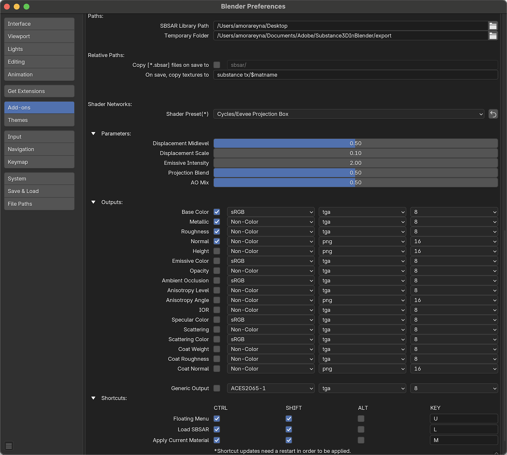

# Preferenze

Le preferenze del componente aggiuntivo si trovano nella finestra delle preferenze di Blender. Passa a Modifica > Preferenze > Componenti aggiuntivi e cerca Nodo: componente aggiuntivo Substance 3D per Blender.

<table>
<tr style="border: 0;">
<td style="border: 0;" valign="top">

</td>
<td style="border: 0;" valign="top">

</td>
</tr>
</table>

<b>Disinstallazione</b>: elimina il componente aggiuntivo dal sistema e lo rimuove dall&#39;elenco dei componenti aggiuntivi in Blender.

<b>Segnala un bug</b>: apre Substance 3D for Blender Discord.

<b>Accetta cartella strumenti</b>: apre l&#39;elenco dei file di Blender per scegliere il percorso di installazione Substance strumenti di integrazione.

<b>Apri strumenti </b>: apri l&#39;elenco dei file di sistema nella cartella Strumenti di integrazione.

<b>Ripristina percorso</b> - Reimposta il percorso predefinito della cartella Strumenti di integrazione.

<b>Strumenti di disinstallazione</b>: rimuove la versione installata degli strumenti di integrazione di Substance 3D.

<b>Aggiorna strumenti</b> - Apre il browser dei file per selezionare il file zip degli strumenti e aggiornare gli strumenti.

<b>Documentazione</b>: apre la pagina della documentazione di Ecosystem e Plugin nel browser.

<b>Forum</b>: apre i forum della community di Adobe nel browser.

<b>Discord Server</b> - Apre il server Discord dell&#39;ecosistema e dei plug-in nel browser.

<b>Affiancatura</b>: regolate l’affiancatura X, Y e Z del materiale. Il blocco può essere utilizzato per scollegare i valori e regolarli singolarmente.

<b>Risoluzione</b>: risoluzione predefinita per le texture generate. Il blocco può essere utilizzato per scollegare e impostare le risoluzioni in modo indipendente.

<b>Applica tipo </b>: imposta il comportamento del pulsante Applica: <b>L&#39;inserimento di </b>sostituirà il materiale corrente con il materiale della Substance selezionato e <b>L&#39;aggiunta</b> aggiungerà il materiale all&#39;oggetto in un nuovo slot di materiale.

<b>Esporta formato immagine</b> - Quando le immagini generate nel modulo di fusione vengono utilizzate come input di immagini per un materiale di Substance, questo formato viene utilizzato per salvare l&#39;immagine nella cartella temporale.

<b>Gruppi di input compressi per impostazione predefinita</b> - Attiva/disattiva i gruppi di input del materiale della Substance espansi o compressi per impostazione predefinita.

<b>Per impostazione predefinita, aggiorna solo le texture</b>: alterna i parametri di Substance per l’aggiornamento del tempo atmosferico che influiscono solo sulle texture di output nella rete di Ombreggiatura del modulo di fusione. Se si disabilita questa opzione, le connessioni ai nodi verranno reimpostate dopo la regolazione dei parametri. L&#39;abilitazione è consigliata quando si aggiungono nodi aggiuntivi a un materiale, altrimenti questi verranno disconnessi dopo la regolazione dei parametri.

<b>Substance motore remoto </b>: imposta l&#39;hardware utilizzato dal motore remoto di Substance.

<b>Applicare automaticamente il materiale</b> - Quando si crea un materiale per Substance, collegare automaticamente il materiale agli oggetti selezionati in un nuovo slot per materiali.

<b>Evidenzia automaticamente il materiale per gli oggetti selezionati</b> - Cambia il materiale evidenziato nel pannello Substance 3D se è selezionato un oggetto con quel materiale.

<b>Aggiornamento automatico della texture dei cicli</b>: forza l&#39;aggiornamento della texture nel riquadro di visualizzazione 3D durante l&#39;utilizzo della visualizzazione di rendering dei cicli.

<b>Rimuovi conferma eliminazione predefiniti</b> - Rimuove la finestra di conferma visualizzata quando si eliminano i predefiniti di materiale.

<b>Creare materiale con un utente falso abilitato</b> - Imposta il tempo in cui il materiale viene creato con &quot;utente falso&quot; abilitato o disabilitato. I dati del modulo di fusione contrassegnati come utente falso non vengono eliminati dopo la chiusura anche quando i dati non vengono utilizzati.

<b>Avvia automaticamente il motore remoto di Substance </b>- Attiva/disattiva se il motore remoto di Substance viene inizializzato all&#39;avvio del modulo di fusione. Se è disattivato, il motore remoto si avvierà solo quando un utente farà clic sul pulsante di caricamento o utilizzerà la scelta rapida da tastiera di caricamento.

>[!NOTE]
>
> NOTA: se si utilizza Substance Connector, l&#39;SRE deve essere attivo affinché l&#39;applicazione di invio possa rilevare Blender come endpoint.

<b>Percorso libreria SBSAR</b>: cartella aperta per impostazione predefinita quando si utilizza il pulsante Carica per cercare un file substance.

<b>Cartella temporanea </b>: questa cartella sarà la posizione predefinita in cui vengono archiviate le texture prima del salvataggio di un file per la prima volta.

<b>Copia file .sbsar al salvataggio in</b> - Se questa opzione è attivata, i file .sbsar vengono copiati nel percorso relativo specificato al salvataggio del file. Questo può facilitare la condivisione di progetti tra dispositivi.

<b>Al salvataggio, copia texture in</b> - Quando un file viene salvato per la prima volta, le texture nella cartella temporanea verranno copiate in questa posizione. La variabile $matname viene utilizzata per creare sottocartelle per ciascun materiale.

<b>Predefinito di Shader</b>: imposta il predefinito di shader utilizzato per la creazione di materiali di fusione da file di sostanze. Può essere impostato su standard per la mappatura basata su UV o la proiezione per la mappatura basata su proiezione a scatola, sfera e cilindro.

<b>Livello intermedio Spostamento</b> - Il valore predefinito è la base per lo spostamento nel nodo di Spostamento. I valori più alti rispetto a quelli di default spingono le superfici verso l&#39;esterno e i valori più bassi rispetto a quelli di default le spingono verso l&#39;interno.

<b>Scala di Spostamento</b>: valore di scala predefinito nel nodo di Spostamento.

<b>Intensità Emissivo</b>: valore predefinito per l&#39;Intensità di emissione nel nodo BSDF con principi.

<b>Fusione proiezione</b>: imposta la quantità di fusione tra gli angoli per gli ombreggiatori del metodo di proiezione.

<b>AO Mix</b> - Quando l&#39;Occlusione ambientale è abilitata come output, questo valore determina il valore predefinito del fattore del nodo MixRGB utilizzato per combinare le texture di Colore di base e Occlusione ambientale.

<b>Output</b>: i singoli output dei materiali possono essere abilitati o disabilitati. È possibile regolare anche lo spazio colore predefinito, il formato del file e la profondità di colori dei singoli output.

<b>Scelte rapide </b>: personalizzate i tasti di scelta rapida utilizzati per visualizzare un menu mobile, caricare un materiale di Substance e applicare il materiale corrente. Per rendere effettivi gli aggiornamenti delle scelte rapide è necessario riavviare il sistema.
