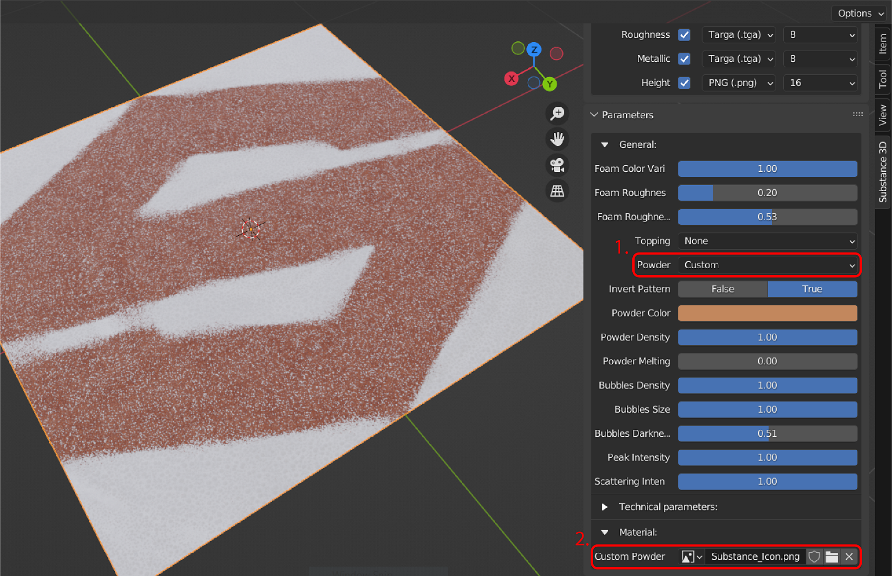

# Flussi di lavoro

## Utilizzo dei cicli

Per impostazione predefinita, le modifiche ai parametri non vengono aggiornate automaticamente nella finestra della vista 3D quando vengono visualizzate nella vista di rendering dei cicli. Per visualizzare gli aggiornamenti nella vista di rendering dei cicli, attiva **Aggiornamento automatico cicli delle texture** in Preferenze per forzare l&#39;aggiornamento.

## File .sbsar a più grafici

Il componente aggiuntivo supporta file .sbrar con più grafici Substance. Quando si carica un file con più grafici, nel pannello Substance 3D viene visualizzato un nuovo menu a discesa Grafici. A differenza di altri parametri, il passaggio da un grafico all’altro non aggiorna automaticamente il materiale. Per questo motivo, è necessario utilizzare il pulsante **Applica** per assegnare nuovamente il materiale dopo aver modificato i grafici.

>[!NOTE]
>
> Per impostazione predefinita, il pulsante Applica aggiunge il materiale in un nuovo slot senza sovrascrivere le precedenti assegnazioni di materiale. Rimuovete i materiali precedenti o utilizzate il menu a discesa dei materiali per riassegnare i materiali appena applicati.

## Utilizzo degli input dell&#39;immagine

Quando si utilizza un materiale di Substance che consente input di immagini personalizzati, un parametro di selezione immagine nel pannello di Substance 3D consente di aprire il browser di file per un’immagine (icona della cartella) o di effettuare una selezione da un’immagine esistente nel progetto (icona dell’immagine a discesa).

La preferenza Esporta formato immagine può essere utilizzata per salvare gli input dell&#39;immagine generati in Blender nella cartella temporanea. Per ulteriori dettagli, consulta la pagina [Preferenze](../../../3d-applications/blender/preferences/preferences.md).

## Predefiniti di rete shader.

Il predefinito shader può essere regolato rapidamente tramite il menu a discesa nella sezione Output del pannello Substance 3D. Questi predefiniti shader regolano il modo in cui vengono applicate le texture dell’immagine.Cicli/Eevee Standard utilizza un normale mapping delle coordinate della texture UV. Gli altri tre predefiniti Cicli/Proiezione scostamento usano il mapping delle coordinate della texture generato per i metodi di proiezione di caselle, sfere o cilindri.

Il predefinito shader predefinito utilizzato dai materiali può essere selezionato nel componente aggiuntivo [Preferenze](../../../3d-applications/blender/preferences/preferences.md).

## Filtraggio e regolazione degli output

La sezione Output del pannello Substance 3D include inoltre opzioni per filtrare gli output. Tre pulsanti accanto al menu a discesa shader predefinito possono essere utilizzati per filtrare in base alle uscite attivate (segno di spunta), alle uscite shader (sfera) e a tutte le uscite disponibili (linee).

Gli output possono essere abilitati singolarmente utilizzando la casella di controllo. Quando un output è abilitato, viene creato un output corrispondente nel gruppo di nodi della texture. Se tale output è supportato dal nodo di materiale BSDF con principi, verrà automaticamente collegato ad esso. Height si connetterà a un nodo di spostamento e Ambiente Occlusione si combinerà con il colore di base in un nodo MixRGB.\
Il menu a discesa del formato del file accanto al segno di spunta può essere utilizzato per impostare il tipo di file con cui viene salvata la texture di output.

Inoltre, è possibile modificare le preferenze predefinite per l&#39;output dei file nel componente aggiuntivo [Preferenze](../../../3d-applications/blender/preferences/preferences.md).

## Scambio di materiali sugli oggetti

Fai clic sull’icona della sfera nel pannello delle proprietà del materiale di Blender per aprire un elenco di materiali nel progetto di Blender. Nell’elenco compariranno anche i materiali di Substance creati nel pannello. La selezione di un materiale da questo elenco comporta la sostituzione del materiale attivo nello slot del materiale.

## Spostamento

Spostamento della trama dalle texture in supportato nel modulo di rendering Cicli, ma non in Eevee. Per visualizzare lo spostamento, assicurati che l’output del Height sia abilitato. Il componente aggiuntivo imposterà automaticamente lo spostamento del materiale su **Spostamento e rilievo**. La visualizzazione del materiale su un oggetto ora mostrerà lo spostamento nella vista di rendering. La scala di spostamento può essere regolata nel pannello materiale o sul nodo di spostamento.

Per risultati ottimali, usa livelli di suddivisioni più alti o trame ad alto poli per materiali con dettagli di spostamento complessi.
