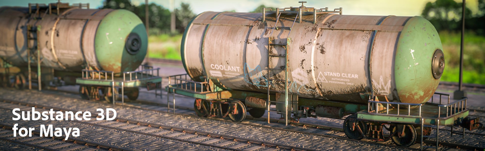

# Maya

## Sommario

* [Note sulla versione del plug-in Maya](../../3d-applications/maya/maya-plugin-release-notes/maya-plugin-release-notes.md)
* [Panoramica di Substance in Maya](../../3d-applications/maya/in-maya-overview/substance-in-maya-overview.md)
* [Installazione](../../3d-applications/maya/installation/installation.md)
* [Substance nodo di output](../../3d-applications/maya/output-node/substance-output-node.md)
* [Utilizzo dei flussi di lavoro](../../3d-applications/maya/using-workflows/using-workflows.md)
* [Utilizzo degli output](../../3d-applications/maya/working-with-outputs/working-with-outputs.md)
* [Campionamento procedurale](../../3d-applications/maya/procedural-sampling/procedural-sampling.md)
* [Predefiniti](../../3d-applications/maya/presets/presets.md)
* [Impostazioni](../../3d-applications/maya/settings/settings.md)
* [Supporto Arnold](../../3d-applications/maya/arnold-support/arnold-support.md)
* [Applica Flusso Di Lavoro Alle Mappe](../../3d-applications/maya/apply-workflow-to-maps/apply-workflow-to-maps.md)
* [Maya Scripting](../../3d-applications/maya/maya-scripting/maya-scripting.md)
* [Dimensioni fisiche a Maya](https://helpx.adobe.com/substance-3d/unlisted/documentation/integrations/232292481.html)
