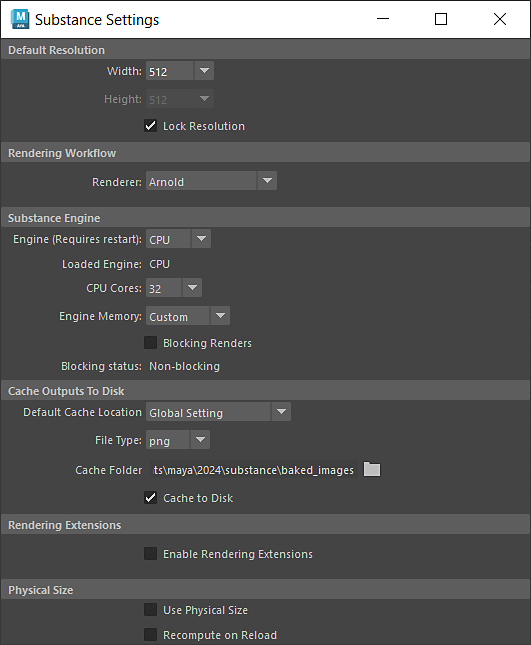

# Impostazioni

È possibile accedere al menu delle impostazioni della Substance tramite il menù Substance o Substance. Le impostazioni per questo menu sono memorizzate in un file di configurazione modificabile &quot;substance.cfg&quot;.

>[!NOTE]
>
> **Percorsi file di configurazione**
> 
> **Windows**:\
> C:\Users\\Documents\maya\\substance\\
> **MacOS**:\
> /Utenti//Libreria/Preferenze/Autodesk/maya//substance/\
> **Linux**:\
> /home//maya//substance/

<table>
<tr style="border: 0;">
<td style="border: 0;" valign="top">

## Risoluzione predefinita

Imposta la risoluzione predefinita per un nodo di Substance quando viene caricato il file sbsar.

## Flusso di lavoro di rendering

Imposta il flusso di lavoro di rendering predefinito da utilizzare nel nodo Substance.

## Substance Engine

Impostazione delle preferenze specifiche per la Substance Engine e globali in tutti i nodi della Substance. Il motore di Substance viene utilizzato per calcolare le texture Substance.

### Tipo di motore

La Substance Engine è disponibile come CPU e motore GPU. Per cambiare motore sarà necessario riavviare Maya. Il motore GPU consentirà risoluzioni superiori rispetto al motore CPU.

>[!WARNING]
>
> Ci possono essere differenze di calcolo tra la CPU e il motore GPU, quindi per risultati coerenti, è meglio impostare il tipo sullo stesso motore utilizzato in Substance Designer.

I core CPU e la memoria del motore corrispondono alle impostazioni relative alla quantità di risorse che il motore di Substance è autorizzato a utilizzare.

### Blocco dei rendering

Questa opzione consente di impostare se il computer del motore di Substance bloccherà i processi dell’interfaccia utente Maya. Quando questa opzione è attivata, il motore di Substance ha la precedenza e blocca i processi dell’interfaccia utente Maya. Quando è disattivata, i processi dell&#39;interfaccia utente Maya non verranno bloccati dai calcoli del motore di Substance.

## Uscite cache su disco

Consente di impostare la posizione predefinita della cache, il tipo di file e la cartella della cache per tutti i nodi Substance appena creati in un progetto.

## Estensioni di rendering

Abilita le estensioni di rendering per utilizzare gli output Substance direttamente con Arnold Shaders.

## Dimensione fisica

Abilita se la Dimensioni fisiche deve essere utilizzata per impostazione predefinita quando i file sbsar vengono caricati e se deve essere ricalcolata quando si ricarica la sbsar.

</td>
<td style="border: 0;" valign="top">

</td>
</tr>
</table>
