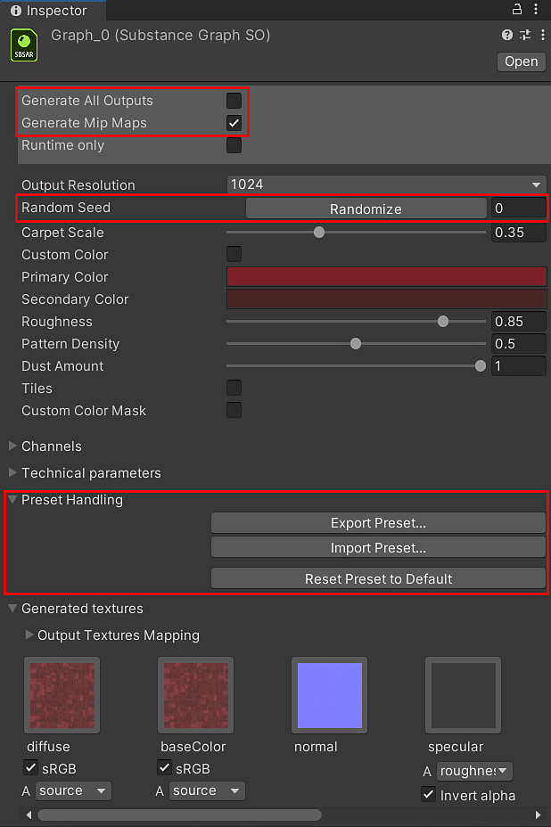

# Modifica dei parametri

<table>
<tr style="border: 0;">
<td style="border: 0;" valign="top">

I parametri per il materiale della Substance sono accessibili sull&#39;oggetto Grafico Substance (SGO).

1. Nella finestra Progetto, selezionate il logo del file sbsar per il grafico che desiderate personalizzare. Il sbsar ha il logo verde &quot;SBSAR&quot;.

   

## Proprietà procedurali

1. **Genera tutti gli output**: genera tutti gli output dal file sbsar Substance. Per impostazione predefinita vengono creati solo gli output utilizzati dagli shader standard.
1. **Genera mapping**: genererà texture MIP per ogni output di Substance.
1. **Numero casuale**: questo pulsante modifica il numero casuale utilizzato dal grafico delle Substance per generare le texture. La modifica di questo valore determinerà la creazione di un nuovo risultato per la texture calcolata in base al valore di partenza.
1. I parametri esposti nel file di Substance sono disponibili in Unity. Il controllo Editor si basa sul tipo di parametro creato per la Substance.
1. **Gestione predefiniti:** È possibile esportare o importare file di predefiniti di Substance (sbsars). L’esportazione di un predefinito crea un file di predefiniti basato sulle impostazioni dei parametri per la Substance. Potete esportare i file di predefiniti da Substance Designer e Substance Player e importarli con il pulsante Importa predefinito. Questa funzione è utile per condividere i predefiniti di Substance tra applicazioni e team.

</td>
<td style="border: 0;" valign="top">

</td>
</tr>
</table>
