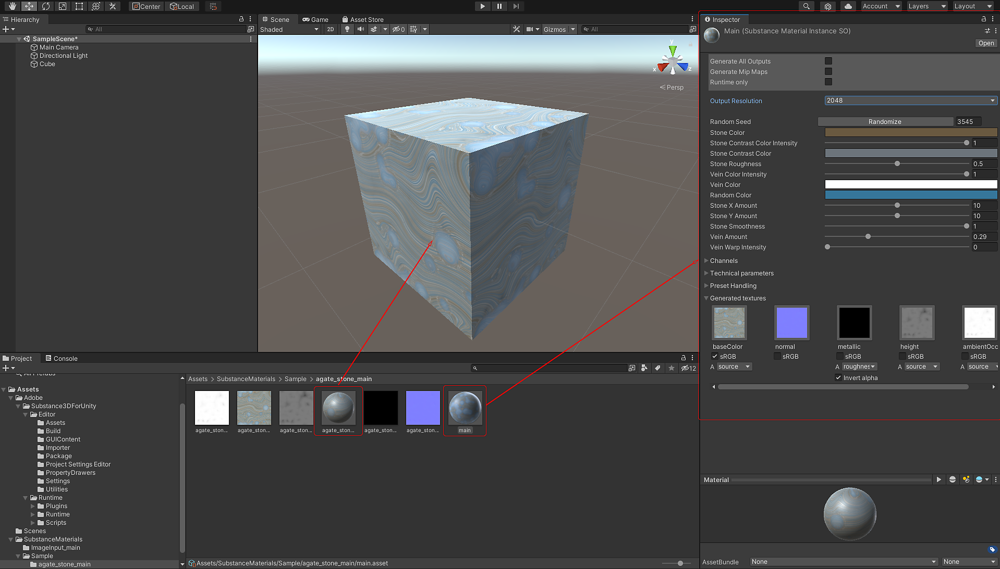

# Panoramica del plug-in di unità

## Supporto delle versioni di Unity

Adobe Substance 3D per Unity Plugin versione 3.0.0 attualmente supporta Unity 2020 LTS e versioni successive.

## Download del pacchetto di Substance

1. È possibile scaricare il plug-in dall&#39;archivio risorse di Unity: <https://assetstore.unity.com/packages/tools/utilities/substance-3d-for-unity-beta-213208>

## Importazione di un materiale di Substance

1. Fate clic con il pulsante destro del mouse nella finestra del progetto e scegliete Importa risorsa oppure trascinate il materiale della Substance da importare nel pannello di visualizzazione del progetto.
1. Cercate il Materiale Substance che desiderate importare. I materiali Substance hanno l&#39;estensione file &quot;.sbsar&quot;.
1. Il materiale di Substance verrà importato nel tuo progetto Unity.

   1. La risorsa sbsar creerà un file di importazione principale e una cartella contenente le texture di output e un materiale Unity generato.
1. Potete quindi trascinare e rilasciare il materiale su una trama nella vista Scena e quindi modificare i parametri nella finestra di ispezione.

   {width="1000px"}

>[!NOTE]
>
> **Conversione mappa normale**
> 
> La Substance nel plug-in Unity converte automaticamente DirectX in OpenGL. Quando si utilizzano materiali di [Substance Source](https://source.substance3d.com/), non è necessario modificare l&#39;orientamento normale in OGL. Se state creando il vostro materiale in Substance Designer, accertatevi di utilizzare lo shader predefinito, in quanto il plug-in gestirà automaticamente la conversione normale. Per ulteriori informazioni, consulta Utilizzo dei normali in Unity.

## Modifica dei parametri

È possibile impostare parametri e risoluzioni nella finestra Ispettore. Vedere [Modifica dei parametri](../../../game-engines/unity/changing-parameters/changing-parameters.md).

[unit\_tweaking\_parameters.mp4](https://helpx.adobe.com/content/dam/help/en/substance-3d/documentation/download/attachments/186056716/unity-tweaking-parameters.mp4)

## Supporto della pipeline di rendering di unità

Il plug-in Substance 3D supporta HDRP e URP. Ulteriori informazioni saranno disponibili a breve.

## Esercitazione
