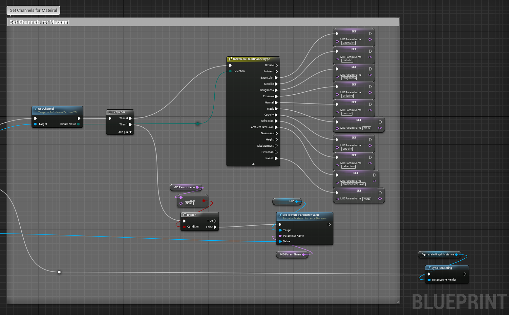

# Blueprint(UE4): Substance aggregata

Il nuovo nodo della sostanza aggregata consente di prendere due factory di istanze di sostanze e creare una nuova factory di istanze in fase di esecuzione che può essere utilizzata per creare una nuova istanza del grafico. Ciò che rende speciale questa operazione è che potete connettere le texture di output da una delle istanze del grafico combinato alle immagini di input dell’altra istanza del grafico combinato. Per creare un&#39;istanza del grafico Substance da questa nuova fabbrica, consulta la nostra documentazione sulle istanze del grafico runtime. [Definizione istanza materiale - UE4](https://helpx.adobe.com/it/substance-3d/unlisted/documentation/integrations/material-instance-definition-157352129.html)

1. Importa la Substance che desideri utilizzare.
1. Creare una variabile &quot;AggregateGraphInstance&quot; di tipo **Istanza di Grafico Substance**.
1. Creare una variabile di tipo **Materiale** e **Istanza di materiale dinamica**
1. Creare una **connessione Substance** e impostare gli identificatori di output e di input.
1. Creare **Aggregate Substance Instance Factory** e impostare Output e Input Factory.
1. Creare una **istanza del grafico** e impostare un nome di istanza.
1. Impostare la variabile **Istanza grafico aggregato**.
1. Ottieni le texture substance dall&#39;istanza del grafico aggregato nel passaggio 7 utilizzando **Ottieni texture Substance**.
1. Create una **istanza di materiale dinamico** utilizzando la variabile di materiale del passaggio 3 come elemento padre.
1. Impostare la variabile MID dal punto 3.
1. Impostate il materiale per la trama utilizzando **Imposta materiale** con la variabile MID.

   {width="800px"}
1. Impostate i canali per il materiale come mostrato nei documenti dell’istanza dinamica del materiale (punti 11-19)\
   [Blueprint(UE4): istanza di materiale dinamico](https://helpx.adobe.com/it/substance-3d/unlisted/documentation/integrations/blueprint-dynamic-material-instance-152535142.html)

   {width="800px"}
