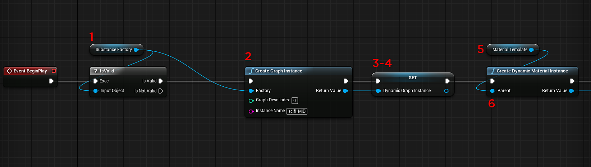

# Blueprint(UE4): Dynamic Material Instance

Potete creare un’istanza di Grafico Substance per creare un’istanza di grafico dinamico in fase di runtime.

1. Creare una variabile di tipo Substance Instance Factory e impostare il valore predefinito su Substance Factory importata.
1. Aggiungere un nodo Crea istanza grafico e collegare la factory dell&#39;istanza di Substance all&#39;input Factory. Impostare un nome di istanza.
1. Creare un&#39;altra variabile di tipo Substance Instance Factory. In questo modo vengono mantenuti i riferimenti al materiale della sostanza dinamica.
1. Impostate la variabile per il materiale della sostanza dinamica con il valore restituito del nodo Crea istanza grafico.
1. Create una variabile di tipo Materiale. Questo sarà il modello di materiale. Nel Browser contenuti, create un duplicato del materiale UE4 generato dalla Substance. Impostate questo materiale duplicato come input per la variabile del modello di materiale.
1. Aggiungete un&#39;istanza Crea materiale dinamico (Create Dynamic Material Instance) e impostate la variabile Modello materiale (Material Template) come padre.

   {width="800px"}
1. Create una variabile di tipo Materiale. Si tratta dell&#39;istanza dinamica del materiale (MID). Impostate il valore restituito di Dynamic Material Instance sulla variabile.

   {width="800px"}
1. Aggiungete un Set Material Node e impostate il valore della variabile MID come Material Input. Per la destinazione, impostatela sull’oggetto a cui desiderate applicare il materiale.
1. Creare una variabile di tipo Name. Questa variabile conterrà il nome dei canali impostati nel materiale. Inizializza con il valore &quot;NONE&quot;
1. Aggiungete un nodo Ottieni texture Substance e impostate l&#39;istanza del grafico sulla variabile Istanza grafico dinamico.
1. Aggiungere un nodo For Loop. Qui puoi sfogliare le Texture della Substance. Prendi il risultato delle Texture di Substance Get come matrice di input.

   {width="800px"}
1. Aggiungere un nodo Substance Get Channel con l&#39;elemento array dal loop for come input.
1. Aggiungere un nodo Sequenza. Qui eseguiremo prima il risultato del nodo Ottieni canale.
1. Aggiungere un parametro su ESubChannelType dopo Sequence Then 0 con il valore restituito Get Channel come Selection. Qui controlliamo i nomi dei canali.
1. Impostate la variabile MID Name sui nomi dei canali nel materiale Substance duplicato al punto 5. *Visualizza l&#39;immagine del materiale.*
1. Nel nodo Sequenza 1, imposterete il processo di assegnazione dei nomi dei canali al materiale dinamico.
1. Ottenere la variabile MID name e aggiungere un nodo di stringa uguale con il valore &quot;NONE&quot;. Questo è il valore che inizializzerà la variabile.
1. Aggiungere un nodo di diramazione con la condizione dal nodo Uguale.
1. Aggiungere un valore di parametro della Texture per l&#39;insieme di Substance. La destinazione è la variabile MID e il nome del parametro è la variabile MID name. Il valore è l&#39;elemento Array del nodo ForEachLoop.

{width="800px"}
