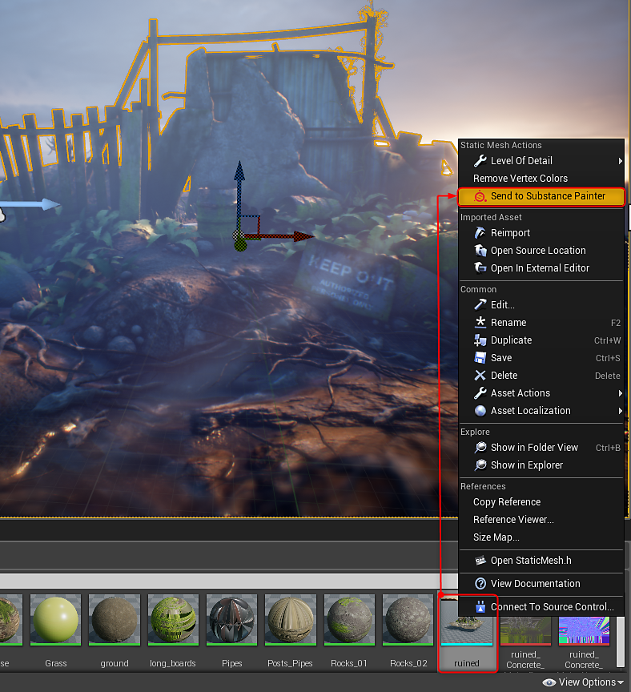
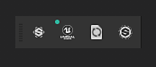

# Live Link in UE4

>[!WARNING]
>
> Live Link in Unreal Engine non è più supportato. Gli utenti con una versione precedente del plug-in in cui viene utilizzato Live Link potranno comunque utilizzare la funzione.

>[!WARNING]
>
> Live Link non funziona con trame BSP UE4. La risorsa che invii deve essere un file modello importato nel tuo progetto UE4

## Creazione del collegamento a Substance Painter

1. Apri Substance Painter
1. Fai clic con il pulsante destro del mouse sulla risorsa che desideri inviare a Painter nel Browser dei contenuti e scegli &quot;Invia a Painter&quot;.

   {width="400px"}
1. La trama verrà visualizzata in Substance Painter ed è possibile iniziare a creare texture. Mentre lavorate, le texture verranno inviate a UE4 e applicate ai materiali. Il punto verde sull’icona UE4 nella barra degli strumenti indica che il collegamento è dinamico e che si inviano texture.

   

   1. Puoi mettere in pausa lo streaming di dati nelle opzioni Configura per il plug-in. Seleziona Plug-in>dcc-live-link e scegli Configura. Disattiva Abilita streaming per sospendere l&#39;invio di dati a UE4.

      
1. Le texture di Painter verranno visualizzate nel Browser contenuti e applicate al materiale in UE4.

   {width="500px"}
1. Un progetto Substance Painter (.spp) verrà creato nella cartella di progetto UE4 in una cartella denominata &quot;.sp&quot;

   

## Ripristino di un collegamento a Substance Painter

Puoi riprendere da dove avevi interrotto dopo aver chiuso Painter o Unity.

1. Apri il progetto .spp in Substance Painter che si trova nella cartella Progetto Unity>risorse>.sp.
1. Fate clic con il pulsante destro del mouse sulla trama nel Browser contenuti e scegliete &quot;Invia a Painter&quot; per ristabilire il collegamento.

   {width="600px"}
