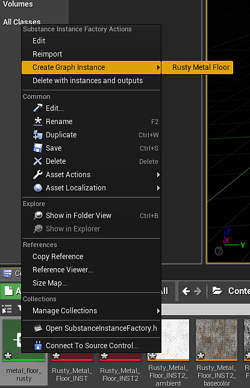

# Definizione istanza materiale - UE4

Potete utilizzare le istanze di materiale UE4 con le Substance. In questo modo si salva un grande passaggio nel processo di rendering GPU non caricando un nuovo materiale da elaborare. È possibile creare un MID in fase di esecuzione o nell&#39;editor. Con la versione 4.24.0.3 è stato aggiunto il supporto completo per l&#39;istanza del materiale e viene introdotto un nuovo flusso di lavoro per modelli di materiale con output numerici supportati dalla Substance Engine. I modelli di materiale consentono di definire esattamente come configurare gli shader di materiale Substance in UE4.

Quando importate un file sbsar, potete scegliere con quale modello lavorare.

Forniamo modelli per lavorare con spostamento, rifrazione e materiali allineati al mondo che hanno integrato i controlli per la regolazione della porzione, della dimensione della texture, dello spostamento e dei parametri di emissione. Il sistema di modelli di materiale consente inoltre di fornire modelli personalizzati.

## Creazione di un&#39;istanza di materiale nell&#39;editor

1. Fate clic con il pulsante destro del mouse sulla sostanza creata UE4 e scegliete &quot;Crea istanza materiale&quot;. In questo modo viene creato un materiale con istanze UE4.

   {width="560px"}
1. Fai clic con il pulsante destro del mouse sulla factory dell&#39;istanza di substance e scegli &quot;Crea un&#39;istanza del grafico&quot;. In questo modo viene creata un&#39;istanza del grafico e viene creato un altro materiale UE4. Eliminate il materiale UE4 appena creato in quanto non verrà utilizzato.

   {width="300px"}
1. Fate doppio clic sull&#39;istanza di materiale creata nel passaggio 1 e abilitate i parametri Texture per tutte le mappe.
1. Impostate la texture sulla nuova texture INST creata dal punto 2. In questo modo si imposta l&#39;istanza del materiale per utilizzare le mappe di output della sostanza dal grafico dell&#39;istanza.

   {width="800px"}

Ora disponete di un&#39;istanza di materiale UE4 che utilizza un set specifico di texture Substance. Questo è un modo più ottimizzato di lavorare con più sostanze in un progetto UE4. Per informazioni su come creare un MID utilizzando blueprint, consultare questa pagina. [Blueprint(UE4): istanza di materiale dinamico](https://helpx.adobe.com/substance-3d/unlisted/documentation/integrations/blueprint-dynamic-material-instance-152535142.html)
