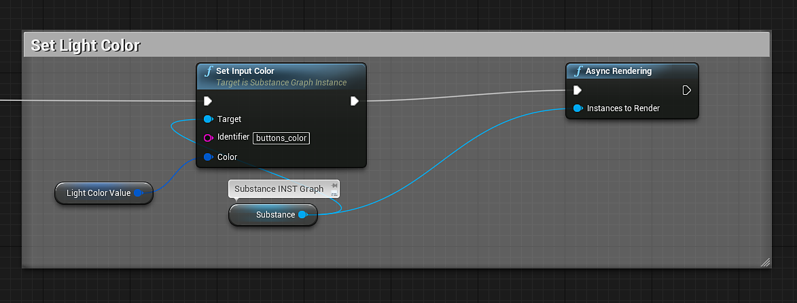
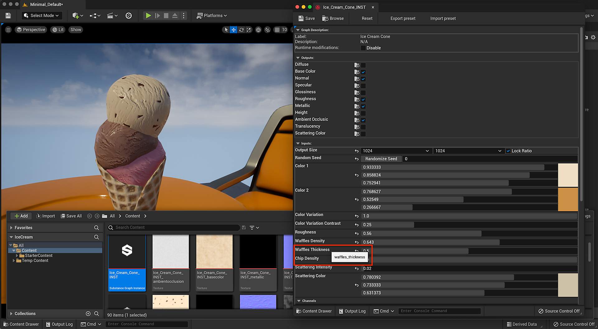

# Blueprint(UE5): Substance parametri materiale

## Modifica di un parametro float:

Per modificare i parametri float, color(float4) e booleano della sostanza, utilizzare il [nodo Float di input](https://helpx.adobe.com/it/substance-3d/unlisted/documentation/integrations/blueprint-node-reference-151584784.html).

1. Create una variabile con un tipo di &quot;Istanza di Grafico Substance&quot; come riferimento.\
   \**A tale scopo, aggiungere una variabile nella scheda Progetto e assegnarle un nome. Nel menu a discesa, cerca Istanza di Grafico Substance > Riferimento a oggetto. Trascinate la variabile nel grafico e selezionate Ottieni (nome variabile). Impostare l&#39;istanza di Grafico Substance nella sezione Valore predefinito della scheda Dettagli.*
1. Creare un set di nodi mobili di input e impostare la destinazione come variabile dell&#39;istanza di Grafico Substance. Per visualizzare tutti i risultati potrebbe essere necessario deselezionare la casella Sensibile al contesto nella finestra di ricerca.
1. Nel nodo Set Input Float, impostare Identifier come nome del parametro Substance da modificare.\
   *\* È possibile trovare il nome dell&#39;identificatore aprendo la Substance INST e passando il mouse sul nome del parametro. Il nome dell&#39;identificatore verrà visualizzato nel popup della descrizione comandi.*
1. Nel nodo mobile di input, trascinare una connessione e creare un nodo Crea array. Il nodo Crea matrice avrà un indice pari a 0. L’indice 0 corrisponde al valore float.
1. Crea un nodo di rendering asincrono o sincrono e collega la linea di esecuzione dall’opzione Imposta dispositivo di input al nodo di rendering. Impostate le istanze da sottoporre a rendering sulla variabile di istanza di Grafico Substance.\
   *\* Async non blocca e Sync blocca.*

{width="800px"}

## Parametri booleani

I parametri booleani vengono modificati utilizzando Set Input Bool.

{width="800px"}

## Parametri colore

I parametri del colore vengono modificati utilizzando Imposta colore di input.

{width="800px"}

## Modifica di un parametro Integer:

I parametri di tipo Integer funzionano allo stesso modo del parametro Set Input Float. Verrà utilizzato il nodo Intero di input impostato.

## Identificatori

È possibile trovare l&#39;identificatore di un parametro nel parametro SUBSTANCE INST. Spostate il mouse sul parametro e la descrizione comandi mostrerà il nome dell&#39;identificatore. Questo è il nome impostato nel campo dell&#39;identificatore dell&#39;output nel Substance Designer.

