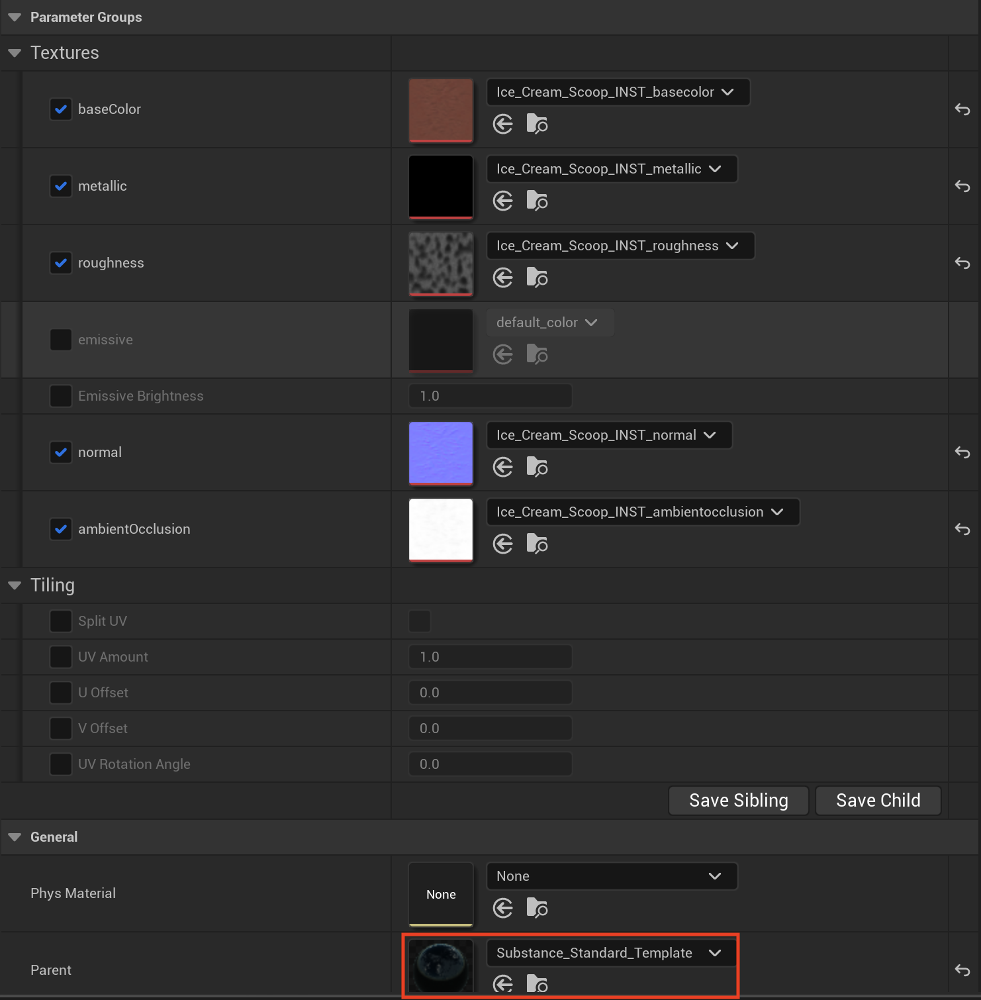

# Modelli di materiale pronti all&#39;uso

Quando importi i materiali SBSAR nel browser dei contenuti, puoi scegliere i diversi modelli di materiale nel menu a discesa disponibili direttamente.

## Substance modello standard

Questo è un modello di materiale di base per un&#39;esperienza UV generica. Fornisce alcuni controlli di base delle quantità di UV in modo da poter ridimensionare gli UV per allungare le texture. Potete dividere il ridimensionamento UV attivando l&#39;opzione Dividi UV e disponete anche di quantità U, quantità V, Offset UV e angolo di rotazione UV. Ciò consente di eseguire alcune operazioni di affiancamento UV e rotazione UV.

## Substance modello triplanare

La maschera triplanare esegue una mappatura triplanare degli angoli o delle facce X, Y e Z della trama in modo da fondere insieme tre diverse proiezioni delle texture per fondere perfettamente gli angoli. La maschera triplanare consente ai materiali di fondersi tra le diverse facce mentre l&#39;oggetto si piega

Il modello triplanare supporta la dimensioni fisiche, quindi quando la dimensioni fisiche è attivata, il modello triplanare ridimensiona le immagini in base alla dimensioni fisiche del materiale, in modo che indipendentemente da quanto ridimensionate l&#39;oggetto, la texture rimanga sempre la stessa e abbia un aspetto uniforme. Ulteriori informazioni Dimensioni fisiche qui: [Dimensioni fisiche - UE5](../../../../../game-engines/unreal-engine/unreal-engine-5/physical-size-ue5/physical-size-ue5.md)

## Substance modello rifrazione

Il modello di rifrazione viene utilizzato principalmente per gli oggetti trasparenti, ad esempio gli occhiali. Consente di modificare il valore IOR o le texture standard che si avrebbero per un materiale in vetro o trasparente.

## Substance modello di pittura per auto

Il modello Dipinto per auto aggiunge un supporto per la pelliccia trasparente e include il supporto per la suddivisione e i valori UV regolabili, i valori di rugosità della pelliccia trasparente e i valori di potenza della fresnel.

## Impostazione dei modelli di Spostamento

>[!IMPORTANT]
>
> Modelli sperimentali
> 
> Avvertenza: i seguenti modelli sono sperimentali e soggetti a modifiche importanti tra le versioni. Questi modelli fanno uso della funzione Nanite di Epic, che è a sua volta sperimentale al tempo di questa scrittura. Possono non essere stabili al 100% e si deve prestare cautela quando si utilizzano questi medicinali nei progetti.

Seguite i passaggi riportati di seguito per abilitare completamente il supporto per lo spostamento Nanite nei vostri progetti e utilizzare i materiali di spostamento con le vostre trame.

1. Passa a Cartella progetto > Config > DefaultEngine.ini e aprilo.
1. Aggiungere quanto segue alla sezione [/Script/Engine.RendererSettings]:
   * r.Nanite.AllowTessellation=1
   * r.Nanite.Tessellation=1
1. Selezionate la trama statica a cui desiderate applicare un modello di spostamento e apritene le impostazioni.
1. Attiva l’opzione Abilita supporto Nanite.
1. Importate il file .sbsar desiderato nel browser dei contenuti e selezionate Substance\_Spostamento\_Modello o Susbtance\_Triplanar\_Displacement\_Template
1. Per modificare la quantità di spostamento, spostarsi sul modello di materiale e selezionare il nodo di output. Quindi, regolate la grandezza sotto la sezione Spostamento.

## Substance modello di Spostamento

Analogamente al modello Substance standard, questo modello consente di regolare i valori U e V aggiungendo il supporto per lo Spostamento Nanite.

## Substance modello di Spostamento triplanare

Analogamente al Modello Spostamento Substance, questo modello applica la proiezione triplanare con l’opzione di supporto Dimensioni fisiche con l’aggiunta del supporto Spostamento Nanite.

