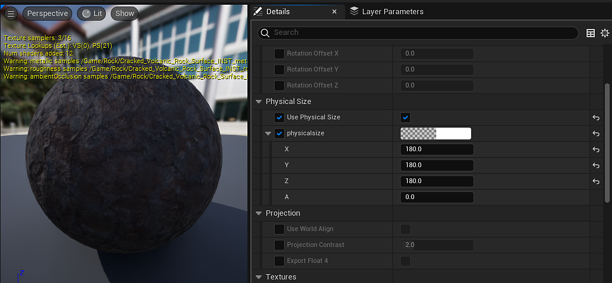

# Dimensioni fisiche - UE5

La dimensioni fisiche nei materiali di Substance consente di ridimensionare i materiali in base alle loro dimensioni nel mondo. Questo valore viene impostato in Substance Designer e letto in Irreale tramite il sistema di modelli di materiale.\
Il materiale [Substance\_Triplanar\_Template](../../../../game-engines/unreal-engine/unreal-engine-5/material-template-usage/out-the-box-material-tem/out-of-the-box-material-templates.md) nella pagina principale contiene un esempio di come la dimensioni fisiche può essere utilizzata per ridimensionare i materiali irreali.

Indipendentemente dai valori di ingrandimento sulla trama, i materiali verranno affiancati in base alle dimensioni che occupano nel mondo in centimetri. Nel caso del materiale roccioso (figura 1), si tratta di 1,8 m (180 cm) per ciascuna misurazione.

I valori dei materiali Substance contenenti dati dimensioni fisiche verranno copiati in qualsiasi nodo di parametro vettoriale del materiale esistente denominato dimensione fisica.

Poiché non è presente alcun valore di spostamento nei materiali in UE5, il modello di dimensioni fisiche copia il valore come X, Y, X per la mappa triplanare.
