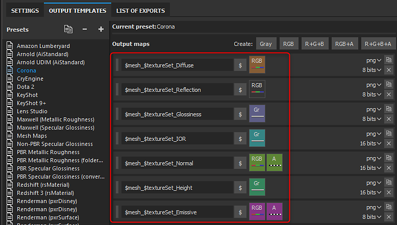

# Corona - Substance Painter

Per il rendering con Corona puoi utilizzare le mappe esportate da Substance Painter o dal plug-in Substance. Corona utilizza il flusso di lavoro Specular/lucidità con una mappa 1/IOR. Avrai bisogno delle seguenti mappe:

* Diffusione
* Riflesso (Specular)
* Lucidità
* 1/IOR (convertito)

Utilizzando il Modello di output Corona, Substance Painter esporta i tipi di mappe convertiti necessari.

>[!NOTE]
>
> Le mappe che rappresentano i dati dovranno essere interpretate correttamente. Per ulteriori informazioni, consultare la pagina [Gestione del colore](../../../renderers/color-management/color-management.md).
