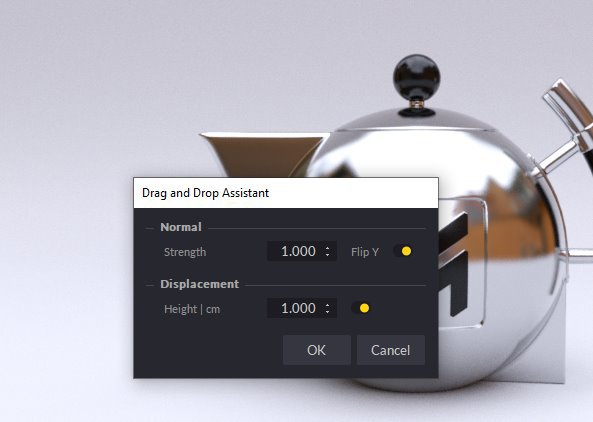

# Integrazione SBSAR Substance

**Puoi** **facilmente**&#x200B;**portare** **file SBSAR** **creati** **nel Substance Designer o nella Substance** **Alchemist** **a** **Maverick &#x200B;**&#x200B;**seguente**&#x200B;**o** **di** **questi** **2** **metodi**&#x200B;**:**

**Metodo** **1:**

1. Utilizzate l’icona SBSAR e selezionate il file SBSAR.

   
1. Nella finestra di dialogo Importa (Import) potete impostare alcuni parametri di materiale:

   
1. Procedete e vedrete il materiale apparire nel pannello Materiali, pronto per essere utilizzato nella scena:

   

   **Metodo** **2**&#x200B;**:**
1. È sufficiente rilasciare il file SBSAR da Esplora risorse a qualsiasi oggetto nella scena. Potete eliminare i file SBSAR anche nel pannello Materiale.
1. Nella finestra di dialogo Importa (Import) potete impostare alcuni parametri di materiale:

   
1. Il materiale verrà applicato all&#39;oggetto su cui lo avete rilasciato.

   **Suggerimenti e suggerimenti:**
1. Potete modificare i parametri SBSAR selezionando il nodo della Substance nel pannello Materiali o facendo clic su uno dei plug di canale del materiale.
1. Consigliamo di modificare il materiale a una risoluzione di 512 o 1024 per rendere più fluida la modifica. Per i rendering finali puoi aumentare la risoluzione a 2048 o 4096.
1. Se desiderate usare lo stesso SBSAR ma con parametri diversi su un altro oggetto nella scena, duplicatelo e applicatelo al nuovo oggetto. Maverick creerà automaticamente un nuovo materiale che potrai modificare in modo indipendente.
1. Se sulla scena sono presenti diversi SBSAR, puoi utilizzare il pulsante &quot;Imposta come risoluzione globale&quot; in uno di questi pulsanti per controllare la risoluzione di tutti i filtri contemporaneamente.

   
1. Maverick include 10 Materiali e SBSAR che è possibile trovare nella libreria di Ombreggiatura in Materiali/Substance e nelle cartelle Mappe/Sbsar:

   
1. Se desideri rendere disponibili le tue SBSAR a Maverick, crea una sottocartella in cui inserirle

   &quot;C:\Users\User\Documents\RandomControl\library\Shading\My Maps&quot;

   Quindi, potete semplicemente rilasciarle sugli oggetti in modo che Maverick possa creare il materiale di wrapper corrispondente.

   È possibile visualizzare un video introduttivo per SBSAR in Maverick qui: <https://youtu.be/HosZOoMRfcM>

   È possibile visualizzare un esempio pratico utilizzando SBSAR in Maverick qui: <https://youtu.be/ebVI5jJD71A>

   **Supporto** **Collegamenti:**

   Invia a [gorilla@maverickrender.com](https://helpx.adobe.com/mailto:gorilla@maverickrender.com)

   Chat nel sito Web Maverick [www.maverickrender.com](http://www.maverickrender.com/)
