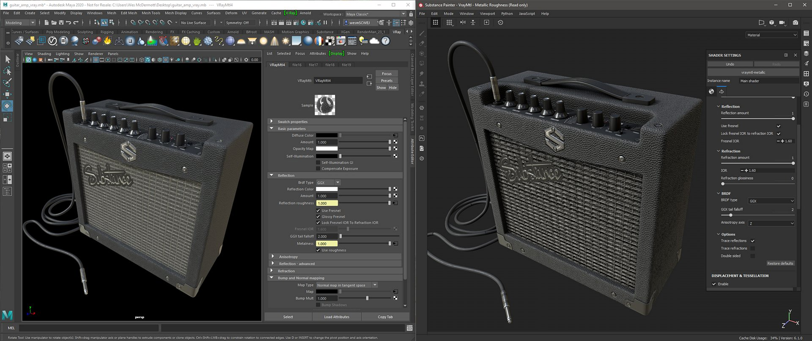

# Vray Next - Substance Painter

Substance Painter 2020.1 (6.1.0) viene fornito con [shader VrayMtl](https://docs.chaosgroup.com/display/VRAY4MAYA/VRayMtl) per flussi di lavoro metallizzati e specular. Puoi [configurare il tuo progetto Substance Painter](https://docs.substance3d.com/display/SPDOC/Project+Creation) utilizzando il **modello VrayMtl**, che configurerà lo shader della finestra della vista.

In Shader impostazioni è possibile configurare lo shader Vray per l&#39;utilizzo di VrayMtl.

>[!NOTE]
>
> Se il progetto è stato configurato per l&#39;utilizzo di [Porzione UV UDIM Legacy](https://helpx.adobe.com/substance-3d/unlisted/documentation/spdoc/uv-tile-udim-legacy-144310352.html). Utilizzate il modello di output di UDIM successivo Vray.

{width="800px"}

Per esportare la texture per il rendering in Vray Next, scegliete il Modello di output Vray Mtl.

{width="800px"}

## Materiale Vray (Vray Next - Metallico/Rugosità)

| Substance Painter esportazione | VRayMtl |
| --- | --- |
| BaseColor | (**Maya**) Diffusa di colore (quantità = 1,0) (**3ds Max**) Diffusa |
| Ruvidità | (**Maya**) Rugosità/Riflessione (BRDF = GGX) + (Usa rugosità abilitata)(**3ds Max**) Rugosità → BRDF/ Usa GGX e abilita Usa rugosità |
| Metallizzato | (**Maya**) Riflessione/Metalness (**3ds Max**) Metalness |
| Normale | (**Maya**) Mappatura/Mappa rilievo e normale (Tipo mappa = Normale in Spazio tangente)(**3ds** **Max**) Bitmap → Normale |
| Altezza | (**Maya**) Shader/spostamento di Spostamento (**3ds** **Max**) Modificatore oggetto → VrayDisplacementMod → Mappa di testo |
| Con emissioni | Auto-illuminazione |
| Trasmissivo | (**Maya**) Dispersione sottosuperficie/Colore Traslucidità (**3ds Max**) Traslucidità → Colore retro |
| AnisotropiaAngolo | Rotazione (**Maya**) Anisotropia/Anisotropia (**3ds** **Max**) BRDF/Rotazione |
| AnisotropiaLivello | (**Maya**) Anisotropia/Anisotropia (**3ds Max**) BRDF/Angolo |

## Vray Material (Vray Next - Specular/lucidità

| Substance Painter esportazione | VRayMtl |
| --- | --- |
| Diffusione | (**Maya**) Colore diffuso (quantità = 1,0) (**3ds Max**) Diffuso |
| Speculare | (**Maya**) Riflessione/colore riflessione (quantità = 1,0) (**3ds Max**) Riflessione |
| Lucidità | (**Maya**) Riflessione/Rugosità (BRDF = GGX) + (Usa rugosità abilitata)(**3ds Max**) Lucidità → BRDF/Usa GGX e abilita Usa lucidità |
| Normale | (**Maya**) Mappatura/Mappa rilievo e normale (Tipo mappa = Normale nello spazio tangente)(**3ds** **Max**) Bitmap → Normale |
| Altezza | (**Maya**) Spostamento Shader/spostamento (**3ds** **Max**) Modificatore oggetto → VrayDisplacementMod → Mappa di testo |
| Con emissioni | Auto-illuminazione |
| Trasmissivo | (**Maya**) Colore diffusione/trasparenza sottosuperficie (**3ds Max**) Traslucidità → Colore retro |
| AnisotropiaAngolo | Rotazione (**Maya**) Anisotropia/Anisotropia (**3ds** **Max**) BRDF/Rotazione |
| AnisotropiaLivello | (**Maya**) Anisotropia/Anisotropia (**3ds Max**) BRDF/Angolo |

>[!NOTE]
>
> Le mappe che rappresentano i dati dovranno essere interpretate correttamente. Per ulteriori informazioni, consultare la pagina [Gestione del colore](../../../renderers/color-management/color-management.md).

In questo esempio viene mostrata la finestra della vista Substance Painter utilizzando lo shader Vray Metallic/Rugosità e il rendering Vray utilizzando Maya.

{width="800px"}
